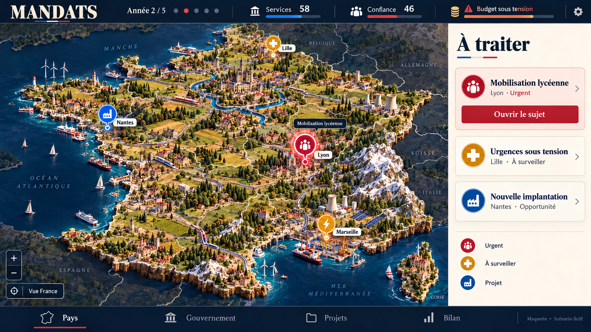

# MANDATS : référence du diorama 3D

## Références visuelles

Le 8 octobre 2026, le propriétaire a explicitement confirmé cette maquette avec la consigne : « C’est elle donc tu rapproches systématiquement de ça quand tu penses avoir terminé ».

La [référence principale](mandats-diorama/reference-ordinateur.png) est la première carte sur ordinateur : en-tête MANDATS bleu nuit, panneau ivoire « À traiter », mobilisation lycéenne à Lyon, marqueurs à Lille, Nantes et Marseille, navigation en bas. La France est une miniature riche en architectures, reliefs, végétation et activités, entourée d'une mer bleu profond. La lumière est chaude et les titres utilisent une typographie à empattements.

Le fichier conservé reproduit cette maquette originale. Il remplace la proposition ultérieure charbon et menthe qui avait été désignée à tort comme référence principale. La [précédente étude mobile](mandats-diorama/reference-mobile.png) reste un complément pour la concision des sujets et des réponses ; son style ne remplace pas la direction artistique de l'image confirmée. Les adaptations mobiles doivent conserver cette direction avec une lecture simple.

La maquette est une référence artistique. Les captures de validation doivent provenir du navigateur exécutant le jeu. Le code, le moteur de jeu et les contrôles HTML fournissent les interactions et les conséquences.

Les exigences ultérieures du propriétaire restent applicables : lecture simple, peu d'informations simultanées, choix direct, aucun cadratin, aucune flèche ni aucun chevron. Les jauges, onglets et flèches présents dans certaines maquettes ne constituent donc pas des éléments à reproduire systématiquement.

## Critères observables

| Aspect | Référence à retrouver dans le rendu réel |
| --- | --- |
| Composition | La France constitue le sujet principal. Son relief reste lisible, les côtes sont reconnaissables et la Corse reste visible au cadrage initial. Le cadrage s'adapte à la surface disponible. |
| Profondeur | L'inclinaison révèle les façades, les reliefs et les vallées. Les bâtiments et arbres sont ancrés au sol par un éclairage et des ombres cohérents. Une inspection change réellement le point de vue dans une scène 3D. |
| Territoire | Forêts groupées, champs, tissus urbains, fleuves, routes et littoral forment un ensemble. Leur répartition évite un semis uniforme de primitives isolées. Les reliefs comportent des crêtes et des variations de pente. |
| Villes | Les agglomérations présentent plusieurs silhouettes, des quartiers, des rues et des repères architecturaux. Un petit village identique posé sur une dalle ne suffit pas à représenter chaque métropole. |
| Matières | Couleurs nuancées et détails perceptibles sur le sol, la pierre, les toitures et l'eau. Les surfaces conservent une unité artistique avec la lumière chaude, la végétation et les tons marins des références. |
| Interface | L'en-tête bleu nuit, le panneau ivoire, les titres à empattements et les urgences rouges retrouvent la direction de la maquette confirmée. La composition garde la carte dominante et les sujets immédiatement repérables. |
| Eau et environnement | La mer présente des variations lisibles autour des côtes. L'environnement contribue à la composition, avec des territoires voisins discrets plutôt qu'une grande surface uniforme. |
| Netteté | Le framebuffer conserve au moins la résolution CSS dans le parcours de référence, y compris sur écran à forte densité et après redimensionnement. Les étiquettes restent des contrôles HTML lisibles et accessibles. |
| Lecture | Un sujet ouvert affiche son problème et des réponses distinctes avec un sacrifice concret. Les détails restent consultables à la demande. La carte accompagne la décision sans repousser les choix plusieurs écrans plus bas. |
| Activité | Les mobilisations, projets et livraisons apparaissent à partir des décisions réellement enregistrées. Leur lecture reste possible sans animation. |

## Comparaison obligatoire avant de conclure

Pour chaque itération visuelle :

1. Conserver une capture réelle du jeu sur ordinateur, avec le viewport, le navigateur, la version et les entrées de partie permettant de la reproduire.
2. Présenter cette capture à côté de la maquette principale confirmée. Comparer la composition complète, puis des vues rapprochées des villes, reliefs, forêts, côtes, eau et matières.
3. Examiner également les captures à 390 et 320 pixels et un sujet ouvert : l'adaptation doit préserver la direction artistique, la lisibilité et l'accès aux réponses.
4. Documenter les écarts visibles selon les critères ci-dessus. Tant que le rendu reste sensiblement éloigné de la maquette, poursuivre le travail ou annoncer explicitement une étape intermédiaire. Le travail visuel ne peut pas être présenté comme terminé.

Un succès de compilation ou la seule présence d'un contexte WebGL ne valide pas la fidélité artistique. La passe actuelle et son verdict visuel sont documentés ci-dessous, séparément des preuves historiques.

## Passe 29 capturée le 9 octobre 2026

La [comparaison réelle 29](mandats-diorama/comparaison-29.html) conserve la référence et les cinq vues nationales et rapprochées. Les [sept relevés natifs](mandats-diorama/screens-29/verification.json) utilisent Chromium151, 1 672 × 941, DPR1, graine0 et zéro décision, avec zéro erreur ou avertissement console.

**Verdict visuel : non conforme.** Les Alpes ont des crêtes angulaires, Paris des îlots et venelles, les coteaux centraux de grandes parcelles courbes et les falaises des facettes stratifiées. Les images montrent cependant une neige trop rare, une pierre trop grise, des campagnes encore olive et un rivage trop uniforme. La fidélité reste en cours.

Le build complet a réellement passé 1 082 tests et toutes ses étapes. L’[audit physique composé](mandats-diorama/screens-29/physical-summary-final.json), avec son [reçu](mandats-diorama/screens-29/physical-receipt.json), vérifie les 737 maisons, lycée, arbres, places et projets sur 214 entrées verrouillées et les quatre GLB finaux. Les 305 rochers, leur winding, les contacts et le contrôle côtier dense passent les mêmes gardes que28. La construction CPU totale mesurée dure 24,27s ; aucun gain global de chargement n’est établi par le cache de géométrie partagé.

Le [contrôle navigateur ciblé](mandats-diorama/screens-29/focused-models-result.json) du seul chargement différé des GLB échoue encore au délai existant de15s. Les quatre suites complètes restent non exécutées sur29 ; les succès historiques et les captures natives ne les remplacent pas.

## Passe 28 capturée le 9 octobre 2026

La [comparaison réelle de la passe 28](mandats-diorama/comparaison-28.html) conserve la référence et cinq vues du jeu, dont Paris, Seine et Alpes. Les [sept relevés natifs](mandats-diorama/screens-28/verification.json) sont issus de Chromium 151 à 1 672 × 941, DPR 1, mouvement réduit, version 12, graine 0 et zéro décision. Les ressources effectivement reçues correspondent au [build figé](mandats-diorama/screens-28/build.json).

**Verdict visuel : non conforme.** Les ardoises sont maintenant bleu sombre et la pierre se sépare mieux des toits. Les normales des volumes rocheux et leurs avertissements d’ombre sont corrigés. Les massifs se lisent cependant encore comme des amas de galets, la campagne reste trop plane et Paris conserve des files de façades répétitives. Cette passe est une étape intermédiaire ; elle ne reproduit pas la maquette à l’identique.

Le terrain compose deux profils de vallées asymétriques et cinq parcelles à sillons courbes. Six secteurs littoraux reçoivent une épaisseur réelle, avec protections des ports, voies, bâtiments, cours d’eau et projets. La couverture intérieure du rivage est complétée par des triangles exacts, avec les couleurs et hauteurs interpolées du terrain existant. Les atlas des trois kits architecturaux corrigent uniquement leurs surfaces d’ardoise ; la géométrie, les UV, les normales et les autres textures sont conservés. Les générateurs synchronisent ces atlas lors des exports.

`NODE_USE_ENV_PROXY=1 npm run check` a réellement réussi : 1 082 tests, types, compilation complète, pré-rendu et préparation hors connexion. Les sept captures natives enregistrent zéro erreur JavaScript, HTTP, requête ou console, et zéro avertissement console.

Le [contrôle physique composé](mandats-diorama/screens-28/physical-summary-final.json), avec son [reçu réel](mandats-diorama/screens-28/physical-receipt.json), utilise les quatre GLB finaux et 213 entrées verrouillées. Il vérifie les contacts des 737 maisons, du lycée, des arbres, des huit places et rassemblements ainsi que les capacités des 28 familles de projets. Les 305 volumes rocheux restent ancrés dans les véritables triangles du sol. Le contrôle côtier dense conserve 179 172 sondages et rejoue les coordonnées historiques : aucune lacune intérieure ni occlusion terrestre sous les fleuves n’est observée dans ces contrôles. Cet audit CPU ne constitue pas un rendu graphique.

La suite rework a réellement terminé en échec : 19 tests réussis, quatre échecs et neuf omissions prévues. Les échecs concernent le chargement différé des GLB sur ordinateur, la fin du parcours de rejeu sur mobile et deux reprises de sauvegarde sur WebKit. Les suites sociales, en-tête et compatibilité n’ont pas été exécutées après cet arrêt. Le [rapport de lecture des captures](mandats-diorama/screens-28/browser-review.json) conserve les observations sur ordinateur, à 390 et 320 pixels et sur WebKit. Le pilote logiciel cloud ne permet pas de conclure sur la fluidité d’un téléphone physique.

## Passe 25 capturée le 9 octobre 2026

La [comparaison réelle de la passe 25](mandats-diorama/comparaison-25.html) montre la référence face à cinq captures du jeu, dont Paris, les fleuves et les Alpes. Les [sept relevés natifs](mandats-diorama/screens-25/verification.json) et le [build figé](mandats-diorama/screens-25/build.json) conservent les ressources servies, leurs empreintes et les entrées : Chromium 151, 1 672 × 941, DPR 1, mouvement réduit, version 12, graine 0, zéro décision.

**Verdict visuel : non conforme.** Les maisons ont retrouvé des toitures proportionnées et de vrais étages, les rayures d’ombre ont disparu dans les vues examinées, les couleurs des fleuves atteignent effectivement le shader final. Les côtes sont plus lisibles, les parcelles et les bosquets plus présents. Les montagnes gardent cependant de grandes nappes lisses ; le paysage et la pierre restent moins fins et moins composés que dans la référence. Cette passe constitue une étape intermédiaire, pas une reproduction à l’identique.

La reconstruction compose 737 maisons, dont 83 à Paris, avec des géométries et matériaux Blender partagés. Le terrain, les arbres, les voies et les projets utilisent la même projection. Les places publiques suivent les vrais triangles des fleuves : huit esplanades sèches conservent chacune trente positions de rassemblement. Le lycée lyonnais possède une emprise sèche et une fondation jointe à son plancher. Les projets restent issus de la partie sauvegardée ; aucun marqueur fictif de la maquette n’est ajouté pour remplacer cet état.

`NODE_USE_ENV_PROXY=1 npm run check` a réellement réussi : 1 082 tests, types, compilation complète, pré-rendu et préparation hors connexion. Les sept captures natives enregistrent zéro erreur JavaScript, HTTP, requête ou console, et un log informatif Babylon. Le contrôle CPU composé vérifie les 737 planchers, les pieds des arbres, l’école, les places, les foules et les capacités des 28 familles de projets. Il signale encore 25 sondages côtiers où aucun triangle de sol n’est trouvé ; la conformité physique globale reste donc fausse malgré la réussite des contrôles ciblés.

Les suites complètes rework, sociales, en-tête et compatibilité restent non exécutées sur ce build. Les preuves des passes précédentes ne les remplacent pas. Les validations graphiques de cette machine concernent Chromium avec son pilote logiciel ; elles ne prouvent pas une cadence sur téléphone physique.

## Passe 20 capturée le 2026-10-09

La [comparaison de la passe 20](mandats-diorama/comparaison-20.html) présente la référence confirmée et cinq captures réelles : vue nationale, Paris, Seine, Alpes et retour national. Les [sept vues natives](mandats-diorama/screens-20/verification.json) proviennent de Chromium 151.0.7922.173, à 1 672 × 941 pixels et DPR 1. Le [manifeste du build](mandats-diorama/screens-20/build.json) correspond aux empreintes des corps JavaScript et CSS réellement servis. Les entrées de partie sont conservées : version 12, mode national, graine 0, ambition équilibre, zéro décision ; le tour reste à zéro dans chaque vue.

**Verdict visuel : non_conforme.** La passe 20 reste loin d'une reproduction à l'identique de la maquette. Paris a désormais une présence monumentale, les façades et les ombres ont progressé, et la campagne centrale a gagné quelques structures. La silhouette orientale et sud-orientale reste trop resserrée, les grandes plaines se lisent encore comme des surfaces peu épaisses, et les Alpes gardent des pointes et pans géométriques gris sur de larges bases jaunes. Le cadre de l'interface est proche, sans constituer une validation de la carte. La [revue enregistrée](mandats-diorama/screens-20/review.json) provient de /root/reference_review.

- Silhouette nationale : le bord est et la côte sud-est occupent moins de largeur que dans la référence. Sur les coupes horizontales y300, y350 et y650, le bord terrestre chaud visible se situe respectivement à x1139, x1094 et x1084 dans 20, contre x1195, x1162 et x1217 dans la référence. Les écarts de 56, 68 et 133 pixels restent présents. Ces coupes prouvent l'écart de silhouette mais ne sont pas des correspondances géographiques suffisantes pour calculer une déformation.
- Relief et composition de la campagne : les vallons, bosquets et talus ajoutés se voient localement, notamment dans la poche centrale x590-784 / y460-534. À l'échelle nationale, de grands espaces jaunes ou olive conservent cependant une lecture horizontale et diagrammatique. Les rangs de cultures et les alignements urbains restent plus réguliers que le réseau de champs, pentes, chemins et petits groupes bâtis de la référence. La couleur seule ne corrige pas ce manque d'épaisseur et de variété structurelle.
- Massifs : dans la vue Alpes, particulièrement x850-985 / y510-680, les crêtes sont plus découpées mais gardent une organisation en dents et grands pans gris plissés. Les nouvelles ruptures existent, mais les bases jaunes sont encore larges, les transitions de versants sont abruptes et la neige forme peu de caps ou bandes clairement distincts. La référence montre des contreforts et roches plus fragmentés, des creux profonds, des débris à plusieurs échelles et une séparation plus nette entre roche chaude, neige claire et ombres froides.

Le parcours natif relève 0 erreur JavaScript, 0 requête échouée, 0 réponse HTTP en échec, 0 avertissement console et 0 erreur console. Ces comptes utilisent le dernier relevé cumulatif et ne comptent pas plusieurs fois le même événement. Le manifeste consigne 1 082 tests réussis. Le build est réussi selon ce même manifeste.

Le contrôle ordinateur DPR 2 de la passe 20 réussit le zoom, le redimensionnement, une décision sauvegardée puis sa reprise, avec les assertions et délais existants. Le rendu WebGL2 coalesce les demandes et donne priorité au redimensionnement dès que la frame GPU précédente est terminée, sans réduire la résolution sous la taille CSS. Le rapport et les captures sont conservés dans `/workspace/mandats-verification/authored-3d/dpr-20-artifacts/`. La passe 18 avait échoué au redimensionnement ; son rapport et sa trace restent conservés séparément.

Les deux parcours mobiles de la passe 16 ont réussi leurs 30 décisions, sauvegarde, rechargement et rejeu à 390 × 844 et 320 × 740, en 98,405 et 100,103 secondes. Ces résultats concernent la correction de hauteur mobile de cette passe ; la validation des parcours de la passe 20 doit se rattacher à ses propres rapports. La comparaison native ne constitue pas cette validation.

## Passe procédurale rejetée le 8 octobre 2026

La [comparaison de cette passe](mandats-diorama/comparaison-procedurale-rejetee.html) conserve la maquette confirmée et une capture du jeu au même viewport de 1 672 × 941 pixels. Cette passe reprend l'interface bleu nuit et ivoire, les titres Spectral, les marqueurs thématiques et la navigation Pays, Gouvernement, Projets et Bilan. Les deux nouveaux panneaux consultent les votes et projets réellement enregistrés. Les détails restent ouverts à la demande ; aucune jauge ou gravité supplémentaire n'est inventée.

Les villes comportent des quartiers irréguliers, des façades avec corniches, volets, balcons et cheminées, des monuments, trois ports, cinq gares et des voies ferrées. La géométrie architecturale réunit 231 immeubles et 75 maisons rurales, avec vingt matériaux partagés et huit textures locales. Le décor utilise des bassins agricoles régionaux, des haies et vergers, des forêts composées, des côtes claires et des crêtes rocheuses enneigées. L'éclairage révèle davantage les façades et la caméra laisse la France occuper l'essentiel de la carte.

Les sujets nationaux sont ancrés au centre du pays ; les sujets institutionnels restent à Paris. Lors d'une inspection, un lieu hors champ ne reçoit plus une fausse position au bord de l'image. Ses sujets restent accessibles depuis l'agenda et les engagements. Sur téléphone, « Voir le lieu » ramène la carte dans la fenêtre. Les foules occupent l'esplanade du lycée à partir de la mobilisation enregistrée ; un chantier et sa grue représentent le financement réel.

Le propriétaire a rejeté cette passe avec le constat : « La carte ne correspond pas à la maquette. » Les façades répétitives, montagnes fortement facettées, grandes surfaces vides et matières simplifiées empêchent de retrouver la miniature détaillée de la référence. Les corrections de l'interface et les contrôles techniques ne suffisent pas. Cette version n'est pas livrée.

La nouvelle approche utilise des modèles façonnés dans Blender, des quartiers composés, un relief continu et des matériaux locaux. Un secteur complet doit être inspecté dans Babylon avant d'étendre sa réalisation au pays. Cette intention ne constitue pas une validation du résultat ; les prochaines captures doivent établir ce qui a réellement changé.

Les captures et résultats de cette passe sont conservés dans `mandats-diorama/screens-reference/`.

## Passe 12b capturée

La demande actuelle est de reproduire l'image confirmée, avec ses proportions, son cadrage et sa composition. La [comparaison de la passe 12b](mandats-diorama/comparaison-12.html) rassemble la référence et cinq vues réelles du build, leurs entrées de partie et leurs conditions de capture. Sept vues natives ont été exécutées dans Chromium151 à1672×941, sans erreur de navigateur ni décision dépensée. Elles restent artistiquement non conformes : perspective insuffisante, tissus urbains espacés, forêts disjointes, reliefs lisses et matières parisiennes sombres. Les chiffres ci-dessous décrivent exclusivement ce build12b capturé.

Quatre kits GLB locaux fournissent les maisons régionales, les petits immeubles parisiens, la cathédrale et la végétation. Les [sources de fabrication](../tools/mandats-assets/README.md) conservent les géométries, textures, licences et commandes. L'éclairage utilise une version rééquilibrée d'un environnement HDR documenté, sans modifier les atlas pour compenser sa dominante froide.

Le quartier parisien compose quarante volumes autour d'une cathédrale diagonale, avec des façades plus fines, des cours, des rues et des quais. Son relevé de construction accepte les quarante emprises. Les cinquante autres localités présentent 293 maisons acceptées sur les 297 prévues ; quatre emprises sont omises à cause d'une voie ou d'une pente. Ces relevés contrôlent l'ancrage des objets, pas leur ressemblance à la référence.

Le paysage alterne 49 parcelles effectivement rendues, des lisières et des bois. Les reliefs partagent 253 faces géologiques et 430 lignes de rupture. Les frontières régionales intérieures proviennent de la topologie Natural Earth ; elles ne créent pas de nouveau contrôle ou indicateur de jeu. Les ports ont des quais abaissés et segmentés, vingt bateaux, neuf grues et des accès au terrain. Les sillages suivent les coques réellement construites.

Les projets enregistrés occupent de petits modules dans des emprises vérifiées. Une même emprise permet plusieurs projets ; les changements de statut conservent leur emplacement. Les sites sans emprise sûre ne reçoivent pas de position inventée. Le catalogue actuel ne comporte pas de projet à Marseille ou Ajaccio. Les sujets, indicateurs et années restent issus de la partie réellement exécutée, même s'ils diffèrent de ceux illustrés dans la maquette.

## Passe 13 historique, capturée le 9 octobre 2026

La [comparaison de la passe 13](mandats-diorama/comparaison-13.html) présente la même référence confirmée face à cinq nouvelles captures réelles : vue nationale, Paris, Seine, Alpes et retour national. Le [relevé des sept vues natives](mandats-diorama/screens-13/verification.json) conserve le navigateur, les heures de capture, les empreintes des preuves et les résultats techniques. Les JSON associés à chaque image conservent aussi les ressources servies et les actions de reproduction. Chromium 151.0.7922.173 utilise un viewport de 1 672 × 941, DPR 1 et mouvement réduit. Toutes les inspections conservent zéro décision ; aucune erreur JavaScript, requête échouée, réponse HTTP en échec ou message console n'est enregistré.

La scène utilise désormais une vraie caméra en perspective et une projection géographique inversible commune au terrain, aux voies et aux sujets. Les plans locaux des villes conservent leurs dimensions et leur cohérence. Les variantes PBR copient les réglages ORM, AO et normales de leurs matériaux glTF originaux ; les captures de Paris montrent des murs plus clairs et les toitures ardoise des modèles. Le relief présente davantage de facettes, les petits fronts bâtis sont repris et les massifs végétaux sont plus nombreux. La scène initiale enregistrée compte 35 groupes statiques, 8 869 instances statiques et 376 maisons effectivement placées. Ces compteurs ne mesurent ni la fidélité artistique ni une cadence sur téléphone.

Cette passe demeure **artistiquement non conforme à la maquette confirmée**. Les quartiers restent isolés et répétitifs, les grandes plaines ouvertes dominent, les berges manquent de continuité bâtie et végétale. Les Alpes conservent de longs flancs verticaux striés ; les côtes et l'arrière-plan voisin restent réguliers et peu composés. La Corse reste pauvre en constructions à l'échelle nationale. La référence montre une miniature beaucoup plus dense, des crêtes fragmentées et des transitions continues entre architecture, cultures, bois et ports. Le rapprochement de l'interface et la correction des matériaux ne valident pas la carte.

Le contrôle complet des types, les 1 082 tests existants, le build, le pré-rendu et le précache de 149 ressources réussissent avant ces captures. Les suites de navigateur sur les parcours de partie, sauvegarde, mobile, WebKit et hors connexion restent à exécuter sur ce build. Leurs résultats devront être rattachés à la version réellement contrôlée ; les validations anciennes ci-dessous sont historiques.

## Reconstruction historique avec modèles Blender, passe 07 du 8 octobre 2026

La [comparaison historique](mandats-diorama/comparaison-20261008.html) présente la maquette et le jeu exécuté au même viewport de 1 672 × 941 pixels. Les [conditions de capture](mandats-diorama/screens-modeles/ordinateur.json) conservent les ressources servies, le framebuffer et les actions natives. Version 12, scénario 0, ambition `equilibre`, zéro décision avant et après les inspections. La [vue Paris](mandats-diorama/screens-modeles/paris.png) et la [vue Alpes](mandats-diorama/screens-modeles/alpes.png) montrent la géométrie sous un autre cadrage, sans pose de caméra injectée.

La scène charge deux kits GLB locaux créés pour ce dépôt : dix-huit modèles domestiques et trois monuments, puis six essences végétales et une roche. Les maisons ont des façades, fenêtres, toitures et cheminées ; leur atlas UV conserve une occlusion précalculée, une carte normale et une rugosité. Les arbres utilisent une couleur par sommet avec variation et ombre locale. Les [sources Blender et scripts de reproduction](../tools/mandats-assets/README.md) sont conservés. Les versions éloignées partagent les matériaux et conservent leurs silhouettes ; Babylon choisit leur géométrie selon leur taille à l'écran.

Les quartiers régionaux suivent un relief continu et des rues composées. La capture initiale montre 525 maisons réellement placées après les exclusions des rivières, voies, monuments et pentes. Les Alpes forment des crêtes reliées avec des épaules et cols différenciés ; les Pyrénées comportent des vallées. Fleuves, cultures, végétation, bâtiments, foules et chantiers utilisent la même hauteur du sol. Les gares sont différenciées, les ports ont des bateaux et des sillages ; le contexte voisin possède des arbres et des faces minérales en volume. Les modèles partagent leur géométrie et leurs matériaux entre les instances.

Les vues rapprochées et la vue nationale ont été comparées à la référence. Le propriétaire a rejeté cette reconstruction : « On est encore au niveau zéro de l’objectif visuel », puis demandé de « répliquer à l’identique la maquette ». Les corrections de proportions ne valident donc pas la direction artistique. Les champs dominent encore, les fronts de rue sont espacés, les grands flancs rocheux trop lisses, les couronnes simplifiées et l'arrière-plan uniforme. Les matières et l'éclairage n'ont pas la finesse de la maquette. Cette version n'est pas livrée. La composition, les façades et les matières doivent être reproduites depuis l'image confirmée, sans proposer une autre interprétation.

Le chargement est asynchrone : une décision prise pendant le téléchargement reste enregistrée et la scène affiche ensuite l'état courant. Un modèle indisponible laisse la carte de repli, les choix et la sauvegarde utilisables. Les URL des kits portent une empreinte de contenu commune au code et au précache, afin qu'un ancien service worker ne fournisse pas un ancien GLB au nouveau code. Un contexte graphique perdu conserve également le parcours de repli jusqu'au rechargement.

Sur un pilote qui ne rend que quelques images par seconde, les animations décoratives passent automatiquement à un rendu lors des changements de caméra ou de partie. Une [observation à 320 pixels sur la passe 05](mandats-diorama/screens-modeles/runtime-320-prototype05.json), sans préférence de mouvement réduit, mesure une carte prête à 8,8 secondes et un clic Ma partie à 53 ms après cette adaptation. Elle documente le pilote logiciel Chromium/SwiftShader de la machine cloud ; elle ne prouve pas une animation fluide sur téléphone physique. Deux avertissements GPU ReadPixels apparaissent pendant cet amorçage. Les sept vues de comparaison de la passe 07, avec mouvement réduit, ne produisent aucune erreur JavaScript, avertissement console ou erreur HTTP.

Le build complet réussit, avec les contrôles TypeScript et le précache de 143 ressources. Les 1 082 tests existants passent. Le bundle principal Mandats atteint 584,40 kB gzip et conserve l'avertissement de taille. Les modèles représentent environ 6,1 MiB supplémentaires ; leurs détails sont embarqués, sans décodeur ou service graphique distant. Les [empreintes du build](mandats-diorama/screens-modeles/build.json), le [relevé du terrain](mandats-diorama/screens-modeles/terrain-survey.json) et la [revue visuelle](mandats-diorama/screens-modeles/revue-visuelle.md) sont conservés.

Les sections suivantes décrivent la correction précédente et ses preuves historiques.

## Causes établies sur le rendu précédent

Le moteur Babylon utilise le niveau de mise à l'échelle comme un diviseur. L'ancienne formule augmentait ce diviseur avec la largeur et la densité de l'écran. Le parcours réel ajouté avant correction reproduit, à DPR 2, un canvas de **636 × 535 pixels** affiché dans une surface de **1060 × 892 pixels CSS**. Le navigateur agrandit ce résultat, ce qui explique une partie du flou.

Le décor précédent utilise principalement des couleurs unies et n'a pas d'ombres portées. Un éclairage hémisphérique important réduit les contrastes de volume. Les montagnes sont des bosses régulières ; les villes partagent les mêmes petites maisons sur une dalle rectangulaire ; arbres et champs sont distribués avec peu de composition territoriale. Leur accumulation ne produit pas la richesse visible dans les références.

Le monde statique dispose déjà de fusions de meshes par matériau. Les personnes des foules restent composées de plusieurs meshes chacune. Des effets ou ombres supplémentaires doivent tenir compte de ce coût, particulièrement quand plusieurs mobilisations sont actives.

## Correction réalisée

Le terrain est reconstruit avec des crêtes, des vallées, des falaises stratifiées et des faces rocheuses. Les Alpes, les Pyrénées et la Corse ont des profils distincts. Les forêts forment des massifs ; les champs deviennent des parcelles irrégulières, avec un grain local et quelques sillons. Les fleuves et routes suivent des courbes. Les villes réunissent plusieurs rues et silhouettes de bâtiments, des toits en pente, des fenêtres, des monuments et des ports. Les petites localités intermédiaires relient le paysage aux agglomérations.

L'eau utilise un shader local avec variations de profondeur, vagues fines et reflet de lumière. Les pays voisins sont construits depuis les contours Natural Earth, avec une lumière et une palette discrètes. Leur décor apporte un contexte géographique. Il ne crée aucun sujet hors du périmètre du jeu.

Une lumière directionnelle chaude projette les ombres des bâtiments et du terrain. Les ombres statiques sont recalculées quand un projet change ; les personnes, véhicules et parties mobiles des grues sont exclus de ce cache. Les parties des foules partagent des modèles instanciés. Les décors sont fusionnés par matériau et attributs compatibles pour préserver leurs textures ; la scène initiale compte 37 groupes statiques.

Le framebuffer tient compte du DPR avec un budget de pixels, tout en conservant au moins la résolution CSS même lorsque la cadence demande un allègement. La caméra ajuste le cadrage à la surface disponible, conserve la Corse et recalcule ce cadrage avec « Recentrer ». Un déplacement manuel, y compris à la molette, conserve ce cadrage au redimensionnement. Les villes et projets sont ancrés sur la hauteur du terrain. Le canvas persiste entre les décisions. La carte occupe toute la largeur disponible, avec des marqueurs ponctuels et leurs étiquettes HTML.

Les textures, modèles et shaders sont générés localement, sans requête vers un service graphique. Les contours France et pays voisins viennent de [Natural Earth](https://www.naturalearthdata.com/about/terms-of-use/), données du domaine public distribuées par [world-atlas 2.0.2](https://github.com/topojson/world-atlas). Les reliefs, parcelles, bâtiments et positions secondaires sont un décor de simulation, pas des données cadastrales ou un relevé d'équipements.

Cette correction augmente la profondeur, la netteté et la variété du rendu réel. Elle reste un diorama procédural : la finesse des matériaux, la densité architecturale et la richesse des modèles n'égalent pas encore les images de référence. Les captures du navigateur, et non les maquettes, montrent le résultat livré.

## Captures comparatives du navigateur

Les vues initiales utilisent la version 12, seed 0, ambition `equilibre`, sans décision. Le viewport et le framebuffer figurent dans les JSON portant le même nom que chaque vue.

| Format | Avant correction | Après correction | Sujet ouvert |
| --- | --- | --- | --- |
| Ordinateur, 1779 × 1016 | [Avant](mandats-diorama/screens/avant-desktop.png) | [Après](mandats-diorama/screens/apres-desktop.png) | [Lycées](mandats-diorama/screens/apres-desktop-sujet.png) |
| Téléphone, 390 × 844, DPR 2 | [Avant](mandats-diorama/screens/avant-mobile.png) | [Après](mandats-diorama/screens/apres-mobile.png) | [Lycées](mandats-diorama/screens/apres-mobile-sujet.png) |
| Téléphone, 320 × 740, DPR 2 | [Avant](mandats-diorama/screens/avant-compact.png) | [Après](mandats-diorama/screens/apres-compact.png) | [Lycées](mandats-diorama/screens/apres-compact-sujet.png) |
| WebKit, 390 × 844, DPR 2 | | [Après](mandats-diorama/screens/apres-webkit.png) | [Lycées](mandats-diorama/screens/apres-webkit-sujet.png) |

[L'inspection d'une mobilisation lycéenne](mandats-diorama/screens/inspection-mobilisation.png) montre les façades et les personnes dans le jeu. Les [entrées de cette partie](mandats-diorama/screens/inspection-mobilisation.json) sont importables : le regroupement adopté provoque le mouvement, puis « Voir le lieu » ouvre le cadrage rapproché. Aucun solde, vote ou mouvement dérivé n'a été injecté pour la capture.

La [vue nationale avec un chantier financé à Rennes](mandats-diorama/screens/inspection-chantier.png) utilise une autre partie réelle, seed 1, après l'adoption de `renover-service`. Ses [entrées importables](mandats-diorama/screens/inspection-chantier.json) reconstruisent le projet `service-rives`. La grue représente son statut financé, avant livraison ; cette capture ne montre pas une inspection rapprochée du chantier. Le marqueur d'un projet ouvre son suivi ; le contrôle « Voir le lieu » concerne le sujet ouvert.

## Contrats techniques à préserver

- Le moteur déterministe, les votes, le financement, les délais, les sauvegardes et le rejeu conservent leurs règles. La scène traduit cet état.
- Ouvrir un sujet, déplacer la caméra, inspecter un lieu, redimensionner ou reprendre une partie ne consomme aucune décision.
- Le canvas et la caméra persistent entre les choix. Le changement de décor ne remonte pas tout le jeu.
- Le mouvement réduit présente le même état sans déplacement imposé ni boucle décorative. Un onglet masqué suspend le rendu.
- Sans WebGL ou après perte du contexte, la carte de repli et les choix restent utilisables au clavier et au toucher.
- Chaque nouveau média local et chaque shader nécessaire rejoint la préparation hors connexion. Le précache actuel découvre les imports JavaScript ; les URL de textures doivent être incluses explicitement.
- Les nouvelles représentations géographiques, textures et modèles documentent leur provenance. Le décor ne présente pas un chantier simulé comme un équipement réel observé.

## Validation et reproduction

Le test `a high density display keeps the 3D map sharp through resize and saved resume` de `site/tests/mandats-rework.test.mjs` utilise un vrai contexte DPR 2 et mouvement réduit. Il vérifie la résolution du canvas, la sélection des sujets depuis les marqueurs, la persistance du canvas après redimensionnement, puis une décision réellement sauvegardée, rechargée et reprise sans tour supplémentaire. Il conserve des captures et un JSON comprenant le viewport, le framebuffer, le DPR et les entrées permettant de rejouer la partie.

Son exécution contre le serveur de développement sur le code précédent échoue effectivement sur la résolution. La preuve initiale est conservée sous `/workspace/mandats-verification/dpr-before/`, avec rapport HTML, trace, capture et données de reproduction. Le même parcours contrôle maintenant aussi le zoom molette puis le redimensionnement sur ordinateur. Avant correction, ce cadrage passe réellement d'un rayon 17 à 23,6 ; cette seconde régression est conservée sous `/workspace/mandats-verification/wheel-resize-before/`.

Les parcours rework et sociaux s'exécutent sur bureau, 390 px, 320 px et WebKit. Ils conservent la carte initiale, un sujet ouvert, une mobilisation, un chantier, une inspection rapprochée et une reprise de sauvegarde. Le parcours hors connexion utilise le précache reconstruit. Le test de perte réelle WebGL finance une rénovation adoptée après la perte, ouvre un autre sujet depuis la carte de repli, puis reprend la sauvegarde en 3D avec le même projet, vote et tour. Il collecte les erreurs de page. Les rapports sont dans `site/rework-artifacts/` et `site/social-artifacts/`, ainsi que dans les artefacts du contrôle CI `rework-e2e`.

Le 8 octobre 2026, `npm run check` réussit sur le code corrigé : 1 082 tests existants, contrôles TypeScript, build et précache de 78 ressources. Le bundle Mandats atteint 515,19 kB gzip ; le build conserve son avertissement de taille. Aucun média distant ni nouvelle dépendance n'est ajouté.

Une [mesure de chargement sur le build produit](mandats-diorama/runtime-desktop.json) conserve le profil, les empreintes des assets, les temps de navigation, les ressources transférées et les métriques CDP : premier rendu Babylon observé après 6,24 secondes, environ 898 kB encodés pour 23 ressources, mémoire JavaScript utilisée de 105,55 MiB. Cette observation unique concerne Chromium headless avec SwiftShader, sur la machine cloud et une origine locale ; elle ne prédit pas le temps de chargement ou la consommation totale sur un téléphone.

Les captures réellement inspectées montrent un framebuffer de 1399 × 948 sur ordinateur DPR 1, de 780 × 760 pour 390 × 379,8 pixels CSS sur téléphone DPR 2, de 640 × 622 pour 320 × 310,8 pixels CSS au format compact, et de 780 × 760 dans WebKit DPR 2. Ces quatre captures ne produisent aucune erreur de page. Les textes et choix restent lisibles ; le troisième choix du format 320 px demande un court défilement. WebKit interdit le port 4190 avant le chargement du jeu : utiliser 4180 pour les suites et 4191 pour une preview de capture.

Les mesures Chromium avec SwiftShader documentent le fonctionnement du navigateur de test. Le temps de rendu d'une capture, qui peut inclure la préparation des ombres et shaders, ne mesure pas une cadence stable. La mémoire JavaScript ne couvre pas la mémoire GPU. Un téléphone physique reste nécessaire pour conclure sur la fluidité mobile ; l'attrait et la difficulté du jeu demandent des parties avec des joueurs.
