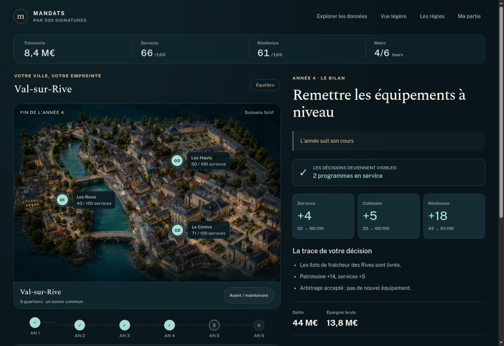
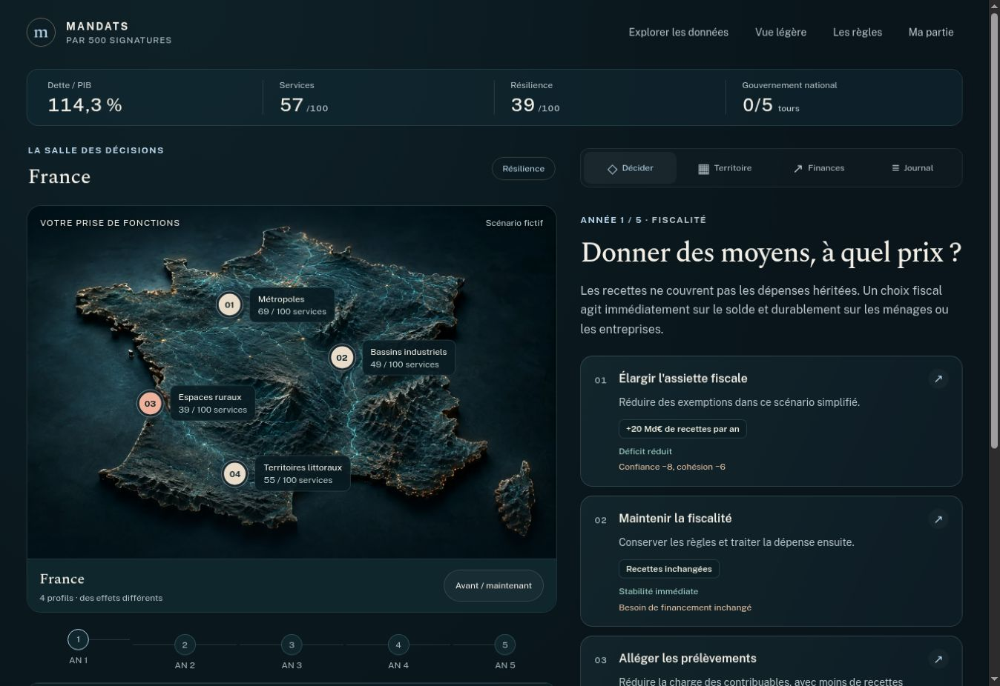

# Mandats : monde illustré et priorités de mandat

La première tranche était jouable mais ses cartes abstraites et ses choix parfois dominants limitaient l'appropriation. Cette évolution associe une présentation territoriale tangible à trois façons de réussir le même mandat.

## Ce qui change

- Choix municipal/national illustré, surfaces bleu nuit, accents ivoire et cuivre, composition avec une ville miniature ou un relief national. Aucun écran de chargement cinématique.
- Le plateau municipal révèle séparément les écoles, les berges et les équipements rénovés quand leurs effets sont livrés. Les chantiers ont une échéance et une localisation. L'état initial reste comparable en un bouton.
- Le plateau national utilise quatre profils territoriaux et leurs indicateurs. L'illustration n'est pas une carte administrative. Les projets restent des engagements et effets territoriaux, sans changement de géographie inventé.
- Sur téléphone, indicateurs compacts, marqueurs consultables, dossier unique, cartes de choix et navigation basse. Sur bureau, le territoire, les engagements et la trajectoire de dette restent à côté du dossier.
- Une carte de décision engage le choix directement. Le bilan explicite les livraisons et la crise ; l'action suivante ouvre le dossier suivant.
- Trois priorités facultatives dans le briefing : Équilibre, Services, Résilience. Elles modifient les poids du bilan et donnent une raison concrète de rejouer.
- La confiance, la trésorerie et les charges transmises ont un effet dans le score. Une tension énergétique tardive récompense une adaptation effectivement livrée dans le bassin exposé.
- La vue légère retire les illustrations ; les préférences de réduction de mouvement neutralisent les animations. Aucun WebGL, vidéo, dépendance graphique ou service externe requis.

## Contrats conservés

`legacy/` fige le moteur v1 pour les sauvegardes, imports et résultats partagés existants. Les nouvelles parties utilisent v2. Les choix, le résultat et le défi portent leur version ; les liens v1 sans version restent v1. Une priorité ne peut être choisie que dans le briefing, jamais changée pour améliorer le bilan d'un mandat terminé.

Les montants et conséquences demeurent des hypothèses de jeu. La [méthode publique](../../site/mandats/methode/index.html) expose formules, pondérations, constantes, périmètres, rôle des illustrations et limites. Pas de prévision économique ou électorale.

## Architecture

- `ambitions.ts` : priorités et poids ; `engine.ts` : transitions et dispatch de version ; `legacy/` : règles historiques figées.
- `municipal.ts` et `national.ts` : paramètres financiers, effets et événements propres à chaque échelle.
- `world.ts` : présentation des projets et territoire dérivée des décisions, sans modification de l'état du jeu.
- `world.css` : disposition, matière, lumière, réactions et adaptations d'écran ; `public/mandats/art/` : images WebP responsives et provenance.
- `render.ts` / `main.ts` : briefing, interface, choix direct, comparaison, détails, sauvegarde et contrôles légers.
- `storage.ts` / `sharing.ts` : conservation de la priorité et de la version, compatibilité des liens historiques.
- `world.test.ts` : compatibilité, équilibre, contraintes, causalité visuelle et tours ; inclus dans la commande CI existante.

Aucun code de `lieflat-charts` n'est repris. Aucun changement d'architecture du site historique n'est nécessaire à ce plateau.

## Résultat vérifiable

Les captures représentent le jeu exécuté. Les images générées servent de textures du monde, jamais de captures prétendument fonctionnelles. Voir [VALIDATION.md](VALIDATION.md) pour les tests, poids de ressources et limites de vérification.

## Portée

Cette livraison renforce la stratégie et la présentation de la tranche jouable. La calibration réelle, les nombreux scénarios, la planification pluriannuelle avancée, la synchronisation cloud, les OG personnalisés côté serveur, la publicité et les opérations sociales restent hors de cette évolution. La qualité perçue, l'ergonomie tactile réelle et la compréhension doivent encore être éprouvées avec des joueurs et des appareils physiques.
