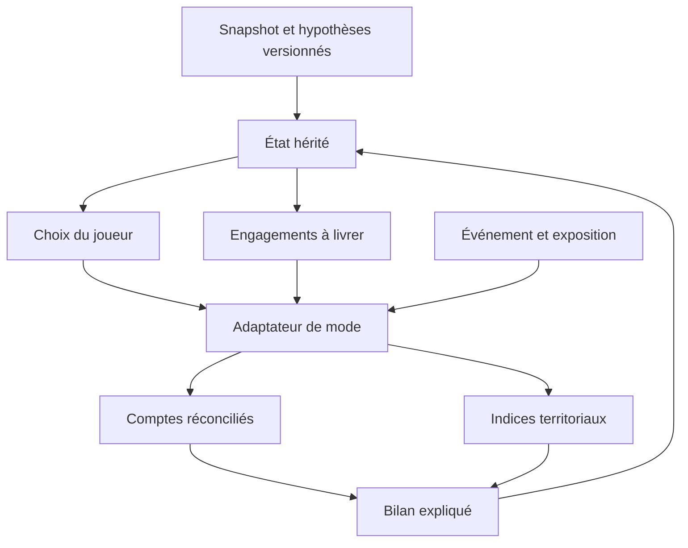
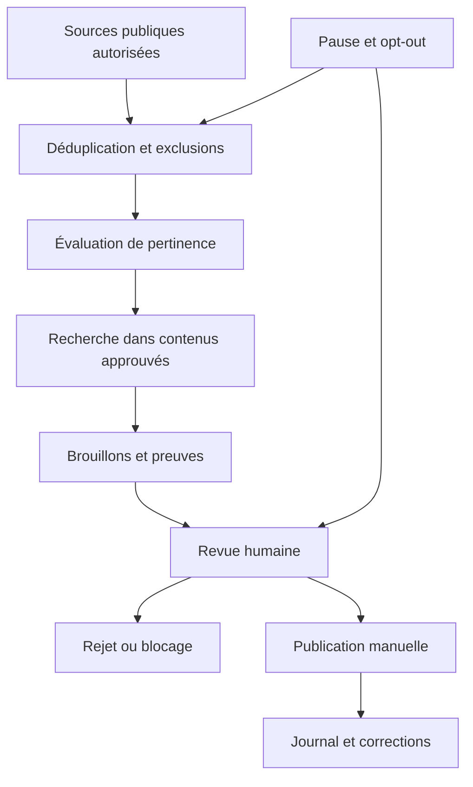
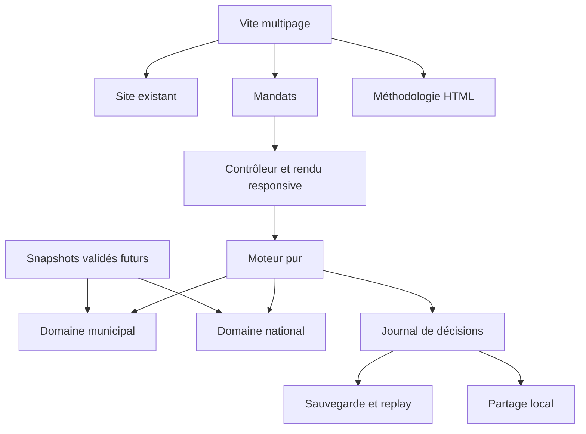

# Mandats · dossier de conception et de livraison

Dépôt : `supertrampsss/500SIGNATURESV2`. État du dossier : 4 septembre 2026. Produit : **Mandats, par 500 signatures**. Les durées, objectifs de performance et résultats commerciaux ci-dessous sont des hypothèses ou des critères de validation, sauf mention explicite d'une mesure. Les sources publiques ont été consultées ; aucune revue humaine certifiée en finances publiques ou en droit n'est revendiquée.

> Statuts historiques : consulter désormais [TO-DO.md](TO-DO.md) et [VALIDATION.md](VALIDATION.md). Mandats a été publié le 5 septembre 2026 ; les tableaux ci-dessous conservent le cadrage initial.

## 1. Executive Verdict

**Décision : construire une plateforme commune, avec un mandat municipal phare de six tours et une introduction nationale complète de cinq tours.** Une nouvelle entrée `/mandats/` isole le jeu du contrôleur historique sans remplacer les données, articles et services existants de 500 signatures. Deux gros jeux AAA simultanés disperseraient les efforts. Deux campagnes étroites permettent déjà de comparer des stratégies, vivre une crise, constater des effets différés et recommencer.

**Livré dans cette branche :** deux campagnes jouables, moteur pur, finances distinctes, territoires schématiques et listes accessibles, effets différés, récupération financière municipale, bilans, sauvegarde locale, export/import, partage volontaire, images de résultat locales en quatre formats, méthodologie HTML, aperçu social générique, intégration au site et tests. **Conçu mais non activé :** acquisition éditoriale, publicité, collecte analytique, comptes, veille X, file de brouillons, cartes OG personnalisées côté serveur, authentification et synchronisation cloud. **À valider :** plaisir de jeu, compréhension, équilibre, accessibilité sur appareils réels, performances terrain et calibration par des spécialistes.

Le [dépôt lieflat-charts](https://github.com/larashero3-dotcom/lieflat-charts) sert exclusivement à l'étude des visualisations. Sa [licence PolyForm Noncommercial](https://github.com/larashero3-dotcom/lieflat-charts/blob/main/LICENSE) interdit de présumer une réutilisation compatible avec la monétisation envisagée. Aucun code de ce dépôt n'est repris. La référence [vidéo X](https://x.com/viktoroddy/status/2095837672690647088/video/1) a été partiellement observable dans le navigateur : composition automobile éditoriale, objet central et typographie expressive. L'intégralité de la vidéo et sa chorégraphie ne sont pas vérifiées.

[Septennats](https://septennats.fr/) fournit une référence forte de décision narrative, temporalité et soutien politique. [La Bataille du Budget](https://labatailledubudget.netlify.app/) construit un rôle ministériel, des objectifs et un capital de jeu. Ces observations ne prouvent ni leurs scores d'accessibilité, ni leur performance sur téléphone, ni leur profondeur sur une campagne entière. Notre avantage à construire est la conséquence territoriale compréhensible, soutenue par des comptes explicables.

Le municipal offre proximité, transformation visible et relais de presse locale ; le national ouvre l'accès à un public plus large. Sur mobile, un dossier et trois choix rendent les arbitrages abordables. Sur ordinateur, carte persistante, engagements et trajectoires ajoutent du contexte. Le partage doit montrer une réussite **et** un compromis. Les pages pédagogiques peuvent devenir des ressources citées et soutenir une publicité discrète, mais aucune rentabilité n'est démontrée.

Risques majeurs : jeu trop court ou stratégie dominante ; moteur national simplifié donnant une fausse impression de causalité ; confusion entre données et fiction ; esthétique ambitieuse sans moyens de production ; classement assimilé à un jugement politique ; données de partage interprétables ; dépendance aux plateformes ; faible économie publicitaire. Réponses : périmètres déclarés, hypothèses visibles, tests, revue experte, validation utilisateurs, absence de profilage et lancement progressif.

**État final visé : « Un territoire dont vous êtes responsable, un héritage que vous pouvez expliquer. »**

## 2. Superpower Brainstorming

Le travail de cadrage a précédé l'implémentation et figure aussi dans le plan daté. Principe : rendre le coût d'opportunité tangible. Un investissement immobilise des moyens aujourd'hui, mobilise des équipes, se livre plus tard et change un service précis. Une bonne session mobile contient un arbitrage mémorable ; une session longue permet d'en comparer plusieurs.

32 idées, dont certaines sont volontairement différées :

1. Hériter d'un territoire imparfait plutôt que d'une page blanche.
2. Faire apparaître la facture future d'un entretien différé.
3. Limiter la capacité de livraison, même quand l'argent existe.
4. Montrer qui paie, qui bénéficie et quand, pour chaque choix.
5. Faire dépendre une crise des investissements antérieurs.
6. Rejouer exactement les mêmes chocs pour comparer deux stratégies.
7. Conserver les engagements non livrés dans le bilan final.
8. Associer chaque chantier à un quartier et à une date de livraison.
9. Opposer désendettement et rénovation sans présenter une réponse universelle.
10. Faire d'une subvention une opportunité conditionnelle, pas de l'argent gratuit.
11. Distinguer service rendu, état du patrimoine et confiance.
12. Donner une voie de redressement douloureuse après une erreur.
13. Proposer des défis sans hausse fiscale ou avec maintien minimal des services.
14. Présenter le mandat comme un carnet d'arbitrages consultable.
15. Ancrer le national dans des profils territoriaux d'exposition différents.
16. Séparer hausse des taux de marché et transmission au coût moyen de la dette.
17. Rendre visible le dénominateur du ratio dette/PIB.
18. Faire du pouce l'outil principal : cartes et commandes basses.
19. Transformer la carte mobile en liste, sans perte fonctionnelle.
20. Offrir sur ordinateur une comparaison avant/après et une planification pluriannuelle.
21. Créer une ambiance de salle de décision par la composition, sans chargement cinématique.
22. Réserver le mouvement aux changements d'état et livraisons.
23. Exporter le résultat avec son principal compromis, pas seulement son score.
24. Partager un défi sans partager ses décisions personnelles.
25. Produire une fiche pédagogique par dilemme, avec sa formule.
26. Organiser des défis de classe anonymes à graine commune.
27. Relier un article sourcé à l'arbitrage jouable correspondant.
28. Versionner sources, règles et corrections comme des objets publics.
29. Transformer les likes X autorisés en hypothèses testables, jamais en profil politique.
30. Assister la réponse sociale avec une file de brouillons sans capacité de publication.
31. Financer les explications par des emplacements publicitaires bornés, hors jeu.
32. Proposer à terme des licences pédagogiques et scénarios partenaires sans contrôle du score.

Trois concepts : **A, Mandats** : campagnes territoriales courtes à effets différés ; **B, Conseil de crise** : dossiers narratifs premium autonomes, budgets et choix limités ; **C, Territoires vivants** : campagnes fédérées multi-échelles et scénarios créés par des experts. Évaluation qualitative interne, non étude de marché :

| Critère | A · Mandats | B · Conseil de crise | C · Territoires vivants |
|---|---|---|---|
| Valeur produit | Responsabilité et conséquences | Comprendre un dilemme | Gouvernance systémique |
| Différenciation municipale | Forte | Moyenne | Très forte |
| Portée nationale | Forte | Forte | Forte |
| Jouabilité mobile | Très bonne si campagnes bornées | Excellente | Difficile |
| Profondeur ordinateur | Forte à enrichir | Moyenne | Très forte |
| Engagement émotionnel | Héritage et territoire | Tension narrative | Appartenance collective |
| Potentiel de jeu | Progression et replay | Variations de crises | Émergence et coopération |
| Crédibilité financière | Bonne avec périmètres explicites | Bonne, système réduit | Difficile à garantir |
| Partage | Bilans, décisions, défis | Dilemmes | Histoires collectives |
| Communauté | Défis comparables | Discussion ponctuelle | Forte modération nécessaire |
| SEO | Méthodes et données | Explications de concepts | Grand potentiel, lourde production |
| Échelle éditoriale | Scénarios et sources | Formats répétables | Risque de contenus inégaux |
| Compatibilité publicité | Contenu adjacent | Guides associés | Forte audience requise |
| Dépendance aux données | Moyenne au départ | Faible à moyenne | Très forte |
| Complexité technique | Modérée | Faible à modérée | Très forte |
| Risque performance | Faible avec SVG | Faible | Élevé |
| Risque social/juridique | Gérable avec transparence | Gérable | Élevé, UGC et échanges |
| Temps vers tranche validée | Estimation 4 à 8 semaines d'équipe | 2 à 4 semaines | 6 à 12 mois ou davantage |
| Décision | Direction principale | Repli premium | Moonshot après validation |

Ces délais concernent une tranche testée auprès d'utilisateurs, pas le seul prototype codé. La branche actuelle n'équivaut pas à plusieurs semaines de recherche terrain.

Comparaison des lancements :

| Dimension | Municipal puis national | National puis municipal | Deux tranches égales | Municipal phare + national introductif |
|---|---|---|---|---|
| Différenciation | Forte | Moyenne | Forte | Forte |
| Délai | Court | Court | Plus long | Modéré |
| Mobile | Simple à polir | Simple à polir | Deux parcours à vérifier | Deux parcours courts |
| Profondeur ordinateur | Municipale d'abord | Nationale d'abord | Effort doublé | Municipale prioritaire |
| Données | Locales fragmentées | Agrégats mieux accessibles | Double chantier | Synthétique puis ingestion ciblée |
| Simulation | Dette, actifs, livraison | Macro et périmètres complexes | Complexité cumulée | Adaptateurs étroits |
| Architecture | Risque d'hypothèses locales figées | Risque d'hypothèses nationales figées | Contrats communs dès le départ | Contrats communs éprouvés |
| SEO | Longue traîne locale | Grande portée concurrentielle | Deux univers | Deux univers, publication graduelle |
| Partage | Fierté locale | Dilemmes grand public | Richesse | Richesse avec promesse honnête |
| Publicité | Contenus locaux | Contenus nationaux | Plus de contenu à produire | Aucun gain immédiat garanti |
| Risque produit | Choix de mode incomplet | Faible différenciation | Dispersion | Second mode à nommer clairement |
| Défendabilité | Données et usages locaux | Faible sans angle propre | Forte à terme | Local + système commun |
| Niveau premium | Concentration favorable | Concentration favorable | Difficile simultanément | Faisable avec périmètre borné |
| Valeur plateforme | Différée | Différée | Forte | Forte |
| Décision | Option si ressources très faibles | Non retenue | Trop ambitieuse à parité | **Retenue** |

Thèse communautaire : « même point de départ, héritages différents ». Un partage ouvre un scénario comparable, sans classement politique ni promesse de vérité. Le MVP exclut multijoueur, comptes obligatoires, ville photoréaliste, tous les ministères, centaines de communes, élections prédictives, IA générant les règles en direct, forum ouvert et publicité active.

## 3. Competitive, Quality, and Visualization Analysis

Périmètre réel de l'audit : pages publiques, texte extrait, interactions et états observés dans un navigateur de bureau. L'application en construction a été vérifiée à largeur CSS mobile. Une campagne complète de chaque concurrent, leurs appareils physiques et leurs métriques terrain n'ont pas été audités. Aucune absence de fonctionnalité ne peut être déduite d'un écran non parcouru.

| Produit | Observé | Force transférable | Limite à ne pas reproduire ou point à vérifier |
|---|---|---|---|
| Septennats | Point de départ historique 1974 ; décisions adopter/refuser/report de deux ans ; ressources annuelles liées à une majorité ; groupes de soutien ; agenda personnel ; cadrage électoral | Contexte avant action, rareté des ressources, conséquences temporelles, narration cohérente | Ne pas transformer les décisions du joueur en rapprochement avec candidats. Lisibilité des systèmes et profondeur mobile à mesurer |
| La Bataille du Budget | Intro de série 2027-2032, rôle de ministre ; objectif scénarisé déficit sous 3 % avant 2030 et dette en baisse en 2032 ; popularité/capital ; phases mensuelles ; création de personnage avec nom, genre et trois profils | Mise en rôle, objectifs visibles, ressources concurrentes | Éviter les données personnelles inutiles et l'onboarding long. Ne pas présenter les objectifs du scénario comme prévision réelle |
| Mandats | Deux échelles, dette locale séparée du déficit national, effets différés et territoires | Proximité + portée nationale, explication du financement | Risque d'une campagne trop courte ; confrontation utilisateurs encore requise |

Sur La Bataille, l'extraction web initiale renvoyait surtout un chargement ; l'interaction navigateur a permis de voir l'introduction et le choix de personnage. Cela justifie de vérifier l'indexabilité, sans conclure que le site est intégralement non indexable. Sur les deux concurrents, les chiffres de performance, l'accessibilité, les taux de complétion, les revenus et l'autorité SEO restent inconnus. Sources : [Septennats](https://septennats.fr/), [La Bataille du Budget](https://labatailledubudget.netlify.app/).

La référence X montre, dans l'état vidéo observable, une page automobile « ArtCar » : voiture bordeaux dominante, fond de studio clair, grand titre serif rouge, navigation discrète et éléments éditoriaux autour de l'objet. La première impression vient d'une hiérarchie visuelle décidée, d'un sujet central et de la retenue. La qualité des textures est observable ; les timings, transitions complètes, profondeur réelle et comportement tactile ne le sont pas. Ces derniers restent des pistes de conception, pas des observations. [Référence fournie](https://x.com/viktoroddy/status/2095837672690647088/video/1).

Traduction : territoire au centre de la narration ; titre expressif mais lisible ; palette limitée ; surfaces hiérarchisées ; apparition d'un bilan après engagement. Municipal : proximité, quartiers, chantiers. National : salle stratégique, indicateurs agrégés et expositions territoriales. Mobile : une décision principale et une animation facultative courte. Ordinateur : carte et engagements persistants. Exclure vidéo obligatoire, parallaxe continue, caméra 3D imposée, particules décoratives et informations uniquement animées. Le jeu livré utilise des cartes fonctionnelles schématiques, pas une ville 3D vivante ; cet écart à l'ambition artistique est explicite.

| Opportunité | Plancher concurrent observé | Différence visée | Preuve nécessaire |
|---|---|---|---|
| Mise en rôle | Forte narration nationale | Héritage local et national | Compréhension en moins de 10 s |
| Temps long | Report, mandat et phases | Livraison + coûts récurrents | Joueur explique un effet différé |
| Territoire | Non audité suffisamment | Conséquences situées | Utilisation des quartiers/profils |
| Crédibilité | Objectifs budgétaires | Comptes réconciliables et périmètres | Revue expert et tests |
| Replay | Variations de choix | Même graine, stratégies distinctes | Retours et diversité des parcours |
| Diffusion | Signaux incomplets | Bilan partageable avec compromis | Ouvertures et parties terminées |

Audit visualisation : le [catalogue](https://github.com/larashero3-dotcom/lieflat-charts/blob/main/catalog.md) et les [notices de tiers](https://github.com/larashero3-dotcom/lieflat-charts/blob/main/THIRD_PARTY_NOTICES.md) présentent plusieurs approches, notamment Chart.js et ECharts. Leurs licences propres ne rendent pas automatiquement réutilisables les modèles qui les entourent. Leçons utiles : annotations proches des données, visuels spécialisés selon la question, export autonome, narration par changement d'état. Éviter les dépendances CDN obligatoires, petites étiquettes, animations de classement, réseaux de forces coûteux et graphiques impossibles à lire sans survol.

Stack retenue : **SVG natif et HTML** pour trois/quatre territoires, courbe de dette et indices ; `meter` et listes de comptes équivalentes. Aucun nouveau paquet de production. MapLibre reste réservé aux usages cartographiques existants du site, sans être chargé par le jeu. ECharts chargé à la demande pourra être évalué si un véritable besoin analytique dépasse SVG ; le catalogue ne dicte ni routes, ni moteur, ni état, ni design.

Niveaux : essentiel = contenu, décisions et bilans sans mouvement ; enrichi = transitions CSS et cartes ; premium futur = couche visuelle facultative, arrêt automatique si mauvais temps de trame ou économie d'énergie. Le niveau essentiel doit toujours permettre de terminer. Pas de détection intrusive de matériel.

## 4. Governance Mode Strategy

Les deux modes répondent à des responsabilités différentes. Une commune arbitre dans des sections budgétaires contraintes, transforme des équipements et livre des services de proximité. Le national arbitre sur des agrégats, des recettes, des dépenses et une dette dont le ratio dépend aussi de la croissance nominale. Les mêmes interfaces de jeu ne doivent pas masquer ces différences.

| Système | Commun | Municipal | National |
|---|---|---|---|
| Cycle | Briefing, choix, résolution, bilan, replay | Six années condensées | Cinq années introductives |
| Contrat | `Domain`, `Game`, `Choice`, `Effect`, `Ledger` | Recettes locales, épargne, capital, trésorerie | Solde APU, dette, PIB et transmission des taux |
| Événements | Déterministes et versionnés | Canicule et usure | Choc énergétique et reprise partielle |
| Territoire | Carte + liste équivalente | Trois quartiers fictifs | Quatre profils fictifs, pas des régions réelles |
| Narration | Conseiller contextuel et journal | Bâtiments, équipes, habitants | Services, financement et énergie |
| Sources futures | Provenance et snapshots | DGFiP, INSEE, SDES, Géorisques | INSEE, Budget, AFT, RTE |
| SEO | Liens vers explications | Finances locales, budget communal | Déficit, dette, périmètres publics |
| Social | Défis et héritages | Relais locaux, enseignants | Dilemmes grand public, professionnels |
| Revenus | Contenus adjacents uniquement | Guides et dossiers communaux vérifiés | Guides et dossiers nationaux vérifiés |

Ordre produit : polir d'abord le municipal, maintenir le national entièrement terminable mais clairement introductif. Lancement public commun seulement après validation des deux parcours. Ne pas appeler une carte verrouillée « mode disponible ». La branche livre déjà deux parcours ; elle n'active pas la campagne de lancement.

Évolution : scénario synthétique → calibration d'une ville-type à partir d'un corpus validé → profils alternatifs → scénario national avec comptes par sous-secteur → planification avancée → ateliers enseignants → éditeur de scénarios contrôlé. Deux jeux complets à grande échelle imposeraient deux équipes de simulation, des flux de données différents et deux chantiers de test ; ce n'est pas le MVP.

## 5. Municipal and National Data & Simulation Models

Audit d'un noyau prioritaire, non inventaire exhaustif de toutes les données publiques. Les sources suivantes ont été identifiées ; leur existence ne signifie pas ingestion ou qualité garantie. **La version livrée n'importe aucune valeur observée dans ses scénarios. Tous ses montants sont synthétiques.**

| Source | Disponibilité et granularité | Usage recommandé | Licence/actualisation/limite |
|---|---|---|---|
| [DGFiP, comptes des communes 2018-2025](https://www.data.gouv.fr/datasets/comptes-des-communes-2018-2025) | Comptes annuels par commune ; fiche actualisée juillet 2026 | Baselines et ratios locaux | Vérifier chaque ressource, disponibilité et licence au téléchargement ; distinguer budgets principaux/annexes |
| [Comptes consolidés des communes](https://www.data.gouv.fr/datasets/comptes-consolides-des-communes-2018-2025) | Consolidation communale annuelle | Comparaisons sur périmètre cohérent | Licence ouverte 2.0 indiquée ; ne pas additionner aux comptes déjà consolidés |
| [Balances communales 2025](https://data.economie.gouv.fr/explore/assets/balances-comptables-des-communes-en-2025/) | Détail comptable | Contrôles et réconciliation | Schéma, millésime et changements de nomenclature à vérifier |
| [INSEE populations](https://www.insee.fr/fr/statistiques/8681011) | Population 2023, entrée en vigueur 2026 | Dénominateurs par habitant | Conserver année statistique et géographie, pas seulement date du fichier |
| [INSEE BPE 2025](https://www.insee.fr/fr/statistiques/8217537) | Équipements ; publication juillet 2026 | Présence et accessibilité potentielle | Présence d'un équipement ≠ qualité du service ; ne pas inventer les dépenses associées |
| [SDES énergie locale](https://www.statistiques.developpement-durable.gouv.fr/donnees-locales-de-consommation-denergie) | Consommation par territoires selon séries | Exposition et intensité énergétique | Secrets statistiques, agrégations et délais de diffusion |
| [Géorisques](https://www.georisques.gouv.fr/donnees/bases-de-donnees) | Aléas et expositions géographiques | Contexte de scénario | Licence et conditions par couche ; un aléa ne donne pas une probabilité de crise calibrée |
| [INSEE comptes publics](https://www.insee.fr/fr/statistiques/8997691) | Comptes annuels APU, révisions | Baseline nationale consolidée | Millésimes provisoires/révisés ; ne pas mélanger une dette d'un trimestre avec un PIB annuel non compatible |
| [Budget de l'État](https://www.budget.gouv.fr/budget-etat) | État, missions/programmes | Explication des politiques et sous-compte État | Budget voté, exécution, comptabilité nationale : trois objets distincts |
| [AFT, chiffres de dette](https://www.aft.gouv.fr/fr/principaux-chiffres-dette) | Dette négociable de l'État | Maturité, refinancement, intérêts | Ne représente pas toute la dette APU ; rythme mensuel selon séries |
| [RTE données régionales](https://www.rte-france.com/donnees-publications/eco2mix-donnees-temps-reel/donnees-regionales) | Production et consommation électriques | Profils d'exposition énergétique | Électricité ≠ énergie totale, production ≠ prix payé |

INSEE décrit ses [conditions de réutilisation](https://www.insee.fr/fr/information/2008466). La règle de pipeline est de conserver une licence explicite par fichier et couche, même lorsqu'un portail est public. Aucune supposition de licence globale n'est admise.

Contrat de provenance : `kind`, producteur, URL, licence, période observée, date de publication, date de récupération, millésime géographique, unité, périmètre, formule, IDs d'entrées, version et qualité. Pour un snapshot ingéré, ajouter checksum, schéma, statut provisoire/révisé et rapport de contrôles. `validateProvenance` dans la branche est une garde minimale, pas un pipeline d'ingestion complet.

| Catégorie | Exemple | Affichage et responsabilité |
|---|---|---|
| Observation | Dépense exécutée publiée | Source, période, périmètre, licence |
| Indicateur dérivé | Dette/épargne brute | Formule et entrées vérifiables |
| Hypothèse | +12 points de services après rénovation | Valeur de jeu à valider |
| Variable de scénario | Canicule année 3, intensité seed | Fiction explicite |
| Décision | Rénover les écoles | Choix du joueur |
| Résultat simulé | Services en fin d'année | Sortie du modèle et version, jamais prévision |

Pipeline cible : téléchargement autorisé → schéma/unités → géographies/périmètres → réconciliation → revue → snapshot immuable → paramètres de scénario. Contrôles : unicité des clés, montants manquants, périmètres constants, totaux, ruptures anormales, révisions. Valeurs manquantes restent manquantes ; elles ne deviennent pas zéro. Pas d'indicateurs de quartier fabriqués à partir de moyennes communales.

Municipal v1, en M€ synthétiques : recettes 100 ; charges hors intérêts 86 ; dette 60 ; trésorerie 8 ; taux 3,5 % ; remboursement annuel 4 ; investissement de base 4 ; subvention de base 2. Les décisions modifient les dépenses récurrentes ou les enveloppes de l'année. Formules :

- Intérêts = dette d'ouverture × taux.
- Épargne brute = recettes de fonctionnement − charges hors intérêts − intérêts.
- Besoin à financer = investissement + remboursement − épargne brute − subventions − trésorerie disponible.
- Nouvel emprunt = max(0, besoin à financer), limité à l'investissement.
- Dette finale = dette initiale + nouvel emprunt − capital remboursé.
- Variation de trésorerie = épargne + subventions + emprunt − investissement − remboursement.

Le moteur exige une épargne positive couvrant le capital remboursé. C'est une **règle de jeu conservatrice**, plus étroite que toute la définition juridique des ressources propres. Le [CGCT L1612-4](https://www.legifrance.gouv.fr/codes/article_lc/LEGIARTI000051731697) encadre l'équilibre réel ; la tranche n'est pas un logiciel de conformité M57. Les [sections fonctionnement et investissement](https://www.collectivites-locales.gouv.fr/gerer-les-finances-publiques-locales/execution-des-recettes-et-des-depenses-locales/depenses-locales/depenses-de-fonctionnement-et-depenses-dinvestissement) sont expliquées séparément. Pas de financement du fonctionnement par emprunt, pas de capital assimilé aux intérêts, pas de seuil de désendettement présenté comme plafond légal universel. Les projets d'école portent sur les bâtiments, conformément à la distinction entre [compétences territoriales et service de l'éducation](https://www.education.gouv.fr/le-role-des-collectivites-territoriales-dans-le-service-public-de-l-education-et-le-partenariat-avec-8138).

National v1, en Md€ synthétiques : recettes 1 490 ; charges hors intérêts 1 500 ; investissement 40 ; dette 3 200 ; PIB 2 800 ; taux moyen 1,8 %, taux de marché 3,5 %, croissance réelle 1,2 %, déflateur 1,8 %. **Périmètre APU consolidé**, et non seul budget de l'État. La coordination entre État, organismes sociaux et collectivités est abstraite ; les sous-comptes ne sont pas encore implémentés.

- Taux moyen annuel = taux précédent + 20 % × (taux de marché − taux précédent). Paramètre de jeu, pas échéancier AFT.
- Intérêts = dette d'ouverture × taux moyen.
- Déficit = dépenses courantes + intérêts + investissement − recettes.
- Dette finale = dette initiale + déficit + ajustement stock-flux (zéro dans ce scénario).
- PIB nominal final = PIB initial × (1 + croissance réelle) × (1 + déflateur).
- Ratio dette/PIB = dette finale / PIB nominal final.

Le refinancement du principal n'est pas une dépense déficitaire ; un agrégat de dette n'est pas le besoin brut d'émission de l'AFT. Le modèle ne simule ni équilibre général, ni comportement complet des ménages, ni marché obligataire endogène, ni effets redistributifs détaillés. Les recettes récurrentes sont fixes hors décisions ; des élasticités fiscales et une vraie structure par sous-secteur exigeraient calibration et revue avant activation.

Services/territoires : indices 0-100, usure annuelle, maintenance, bénéfices ciblés et crise sensible à la résilience. Les quartiers ne sont pas des populations individuelles ; les indices globaux ne sont pas une moyenne pondérée statistique des cartes. Un effet local peut contribuer à un indice global de jeu : cette convention doit être revue avant un mode « données réelles ». Le seed ne contrôle qu'une variation bornée de l'intensité des chocs ; il ne représente pas une distribution probabiliste estimée.



Incertitude : pas de faux intervalles de confiance dans la v1 déterministe. La phase suivante comparera trois jeux de paramètres « effets faibles/centraux/forts » clairement hypothétiques ; ne pas les appeler probabilités. Les scores à 25 % par dimension expriment un choix de design. Le joueur doit voir les dimensions et leurs poids, pas seulement un total. Méthodologie mobile : résumé contextualisé dans un dialogue, page HTML approfondie, unités et limites au voisinage des chiffres. Les corrections doivent être datées et les anciennes parties rester rejouables sous leur version.

## 6. Product, Game & Responsive Design Blueprint

Positionnement : un jeu de stratégie publique pédagogique, neutre et accessible, sous une marque de travail à vérifier juridiquement avant campagne de marque. Publics prioritaires : curieux des services publics, amateurs de stratégie courte, enseignants et étudiants. Publics de profondeur : journalistes, agents territoriaux, professionnels des finances et civic tech. Aucun profil politique n'est attribué.

Promesse : **« Choisissez votre mandat. Gouvernez une ville, ou gouvernez la France. »** Fantaisie municipale : transformer le quotidien sans transmettre une impasse financière. Fantaisie nationale : préserver une capacité d'action dans des arbitrages d'ampleur. Parcours émotionnel : héritage imparfait → premier engagement → attente → choc → correction → fierté nuancée par un chantier restant.

Copie des cartes :

| Élément | Municipal | National |
|---|---|---|
| Titre | Gouverner une ville | Gouverner la France |
| Rôle | Maire et équipe municipale | Gouvernement national |
| Durée de mandat | Un mandat municipal condensé | Un mandat national condensé |
| Temps affiché | 6 tours · 4 à 6 min | 5 tours · 3 à 5 min |
| Défi | Transformer la ville sans compromettre son avenir financier. | Piloter le pays face aux arbitrages budgétaires, sociaux, économiques, climatiques et géopolitiques. |
| Style | Stratégie territoriale | Introduction nationale |
| CTA | Choisir ma ville | Prendre les commandes |
| Difficulté cible | Découverte, contraintes comptables | Découverte, agrégats simplifiés |

Les cartes livrées affichent temps et style ; la difficulté n'a pas encore de niveaux sélectionnables. Aide : « Quel mode me convient ? ». Mention commune : « Scénarios fictifs · Hypothèses accessibles · Aucune prédiction ». Les périmètres financiers détaillés sont au briefing.

Flux nouveaux joueurs : choix → briefing et objectifs → premier dossier → décision → bilan annuel → adaptation → héritage → partage/replay/autre mode. Retour : carte « Votre mandat vous attend » → reprise à la prochaine décision ou au bilan final. Commencer un nouveau scénario remplace la sauvegarde active au premier dossier ; un export manuel permet de conserver une autre partie. Une seule sauvegarde locale est prévue en v1.

**Boucle livrée :** un dossier annuel, trois choix substantiels, application explicite au clic, résolution immédiate avec effets différés conservés. Le texte avertit que le clic engage le choix. Chaque dossier précise dépense ou recette, bénéfice et sacrifice. Un quatrième choix de redressement apparaît seulement si tous les choix ordinaires municipaux violent les contraintes. Il réduit les charges en dégradant services, confiance et cohésion. La récupération coûte quelque chose ; aucune subvention magique ne corrige l'erreur.

| Campagne | Déroulé | Arbitrages | Crises et fin |
|---|---|---|---|
| Municipal | Diagnostic, écoles, fiscalité, chaleur, services, subvention, héritage | Rénover/réparer/reporter ; recettes/pouvoir d'achat ; urgence/adaptation ; équipement/entretien ; aide/réserve ; dette/patrimoine | Canicule modulée par résilience, usure modulée par patrimoine ; rapport à quatre dimensions |
| National | Diagnostic, fiscalité, services, énergie, dette, héritage | Recettes/stabilité/allégement ; fonctionnement/investissement ; bouclier/transformation ; ajustement/préservation | Choc énergétique, reprise partielle, transmission des taux ; ratio de dette et services |

Les parties peuvent être rejouées avec le même seed et d'autres choix. Le défi est la maîtrise des compromis ; pas de boutique, loot box, notification de manque ou récompense de connexion. Les objectifs et indices permettent un échec de mandat relatif, sans écran arbitraire de défaite. Les systèmes politiques détaillés, vote parlementaire, emploi, commerce, défense et logement ne sont pas tous simulés dans cette tranche. Une durée de 20 à 40 minutes sur ordinateur est une ambition future de comparaison et de planification, pas la durée des campagnes actuelles.

Scoring : finances, services, cohésion, résilience/patrimoine, poids égaux de 25 %. Indices bornés de 0 à 100, pénalité explicite pour charges positives en attente de livraison. Trois profils d'héritage selon le total : solide, à consolider, sous tension. Le score est une fonction de conception publique, pas un palmarès des politiques réelles. Avant lancement : explorer tous les chemins légaux, mesurer stratégies dominantes, tester compréhension et diversité ; réviser les coefficients avec un journal de changement. Difficulté future : variations de marge et d'exposition documentées, pas simple inflation punitive des coûts.

Responsive guidé par les besoins :

| Largeur/condition | Transformation | Densité et commandes |
|---|---|---|
| 320 à 560 px | Deux cartes de mode empilées, dossier unique, carte consultable dans un onglet | Pouls à trois indicateurs, navigation basse, pas de tableau horizontal |
| 561 à 820 px | Deux cartes possibles, contenu central plus large | Navigation basse tant que deux panneaux ne tiennent pas |
| 821 à 1100 px | Carte/engagements persistants à gauche, dossier à droite | Comparaison visuelle sans perdre les onglets |
| Plus de 1100 px | Composition éditoriale élargie, cartes de mode avec illustration latérale | Comptes annuels et engagements à côté du choix |
| Paysage de faible hauteur | Pouls et navigation redeviennent statiques | Éviter que les commandes masquent le contenu |

Interactions : boutons natifs, cibles de commande de 44 px minimum, principaux CTA de 48 px ; tabulation logique ; Entrée/Espace pour agir ; Échap pour fermer le dialogue ; retour du focus au déclencheur assuré par le dialogue natif, titre focalisé après changement d'écran. Pas de geste obligatoire, pas de survol exclusif. Listes et `meter` remplacent toute dépendance visuelle à la carte ; SVG possède un libellé. Sur ordinateur, les raccourcis métier restent à concevoir avec alternative visible ; seuls les contrôles clavier standards sont livrés.

Direction artistique livrée : fond encre `#0c1921`, surfaces bleu ardoise, accents sauge pour l'action, doré pour le compromis ; titres Spectral et texte Public Sans déjà auto-hébergés ; contours nets, profondeur légère, chiffres tabulaires. Textes de décision à 14 px minimum, récit à 16 px. Transitions CSS d'environ 200 ms, supprimées sous `prefers-reduced-motion`. Aucun son ni vibration par défaut ; hooks futurs uniquement après choix utilisateur. La carte est une visualisation précise de profils fictifs, pas une géographie réelle.

Inventaire : `ModeCard`, briefing, pouls, carte territoriale, carte décision, prévisualisation financière interne, résolution, registre comptable, courbe de dette, journal, liste des engagements, score, dialogue méthodologique, dialogue sauvegarde et partage. Implémentation actuelle en fonctions de rendu TypeScript plutôt qu'en framework de composants. La planification avancée et la comparaison de portefeuilles ne sont pas encore livrées.

Wireframes textuels, sans diagrammes d'écran trompeurs :

| Écran | Ordre vertical mobile | Composition ordinateur |
|---|---|---|
| Choix du mandat | Marque, promesse, reprise, Ville, France, aide, méthode | Promesse au-dessus de deux cartes, reprise immédiatement disponible |
| Ville, décision | Pouls, année, dilemme, trois choix, conseiller, navigation basse | Carte et engagements à gauche ; dilemme et choix à droite |
| France, décision | Dette/PIB, services, résilience ; dossier fiscal/énergétique ; trois choix | Profils territoriaux et dette persistants ; arbitrage national |
| Résolution, deux modes | Décision, événement, variations, explication, comptes, année suivante | Contexte territorial maintenu avec mêmes explications |
| Héritage | Profil, score, force/faiblesse, dimensions, partage/replay, journal | Rapport à côté du territoire et de sa trajectoire |

Exigences restant à valider : VoiceOver/TalkBack, zoom à 200 %, contraste mesuré de toutes les combinaisons, clavier sur tous les dialogues, Android milieu de gamme et iOS Safari. Une inspection de DOM ou des tests de chaînes HTML ne remplacent pas ces essais.

## 7. Shareability, Social Cards & Community Architecture

Objet social : un arbitrage racontable, avec contexte et limites. Le jeu doit être utile même sans partage. Aucun écran n'exige un repost, aucune carte n'imite une institution officielle.

| Carte | Contenu autonome | Exemple | État |
|---|---|---|---|
| Héritage | Mode, scénario, score, quatre dimensions, force/faiblesse, mention simulation | « Mon héritage municipal : services renforcés, finances à surveiller. » | Résultat HTML + PNG local livrés |
| Décision | Choix, coût, sacrifice, livraison éventuelle | « J'ai rénové les écoles : trésorerie engagée aujourd'hui, bénéfices dans deux ans. » | Modèle éditorial, export dédié différé |
| Défi | Scénario, seed, contrainte, durée et version | « Même ville, mêmes chocs. Quel héritage laisserez-vous ? » | Lien scénario/seed livré ; moteur de contraintes additionnelles différé |
| Donnée | Valeur, unité, période, périmètre et source | « Que finance une section d'investissement ? » | Publication seulement après validation de la donnée |
| Citation éditoriale | Explication signée et lien de méthode | « Reporter l'entretien peut déplacer la dépense plutôt que la supprimer. » | Template prévu, pas de campagne publiée |

Flux mobile : bouton de partage → explication de visibilité → résultat avec choix ou défi seul → Web Share API si disponible → copie manuelle sinon. Flux ordinateur : copie du lien ou téléchargement. Quatre tailles livrées : 1200×630, 1080×1080, 1080×1350, 1080×1920. Pas de vidéo générée automatiquement. Images générées sur l'appareil ; aucun upload de partie.

V1 : sauvegarde privée dans le navigateur. Le lien de résultat contient dans son fragment un journal compact de décisions ; le destinataire peut le reconstruire. Le fragment n'est normalement pas envoyé dans la requête HTTP, mais **le lien n'est ni secret, ni révocable, ni une protection d'accès**. Quiconque le reçoit peut lire les choix. L'utilisateur en est averti avant partage. Défi = mode et seed, sans choix. Pas de nom, profil, historique serveur ou classement. Les imports sont limités, validés et recalculés ; un score déclaré par le lien n'est jamais accepté comme vérité.

Métadonnées livrées : OG/X avec image générique du jeu et dimensions ; LinkedIn exploite OG. Les robots sociaux ne lisent pas le fragment : ils ne peuvent donc pas afficher le score personnel. Cette limite est affichée dans le dialogue. La page HTML de résultat est reconstruite pour l'utilisateur à partir d'un schéma versionné. La page de méthode est statique et lisible sans JavaScript.

Architecture future pour OG personnel : publication explicite d'un résultat minimal → validation/recalcul serveur → ID opaque → page `/mandats/r/:id` en HTML → image au chemin versionné. Rendu à partir de champs autorisés, polices locales, limites de taille, aucune URL de ressource arbitraire, échappement des textes, rate limit et cache par hash du contenu validé. Unlisted signifie hors index, pas privé. Privé exige authentification ; public nécessite consentement clair ; retrait doit invalider page et cache selon politique annoncée. Les quatre formats partagent une même donnée canonique.

Alt : texte de la carte comprenant mode, score et compromis, avec équivalent HTML. Téléchargement d'une image ne garantit pas que le réseau social conserve son alt ; proposer un texte à copier. Le message « Simulation fictive, modèle v1 » doit rester lisible dans une capture recadrée.

Mesure future sous consentement : `share_initiated`, format, contexte de mode, ouverture d'un défi, démarrage et complétion agrégés. Une ouverture de dialogue n'est pas un partage publié. Ne pas envoyer le journal de choix à l'analytics. Embeds futurs : graphiques figés avec source, date, fallback image et lien accessible ; iframe sans cookies tiers ni accès au parent. Pas d'embeds créés dans cette branche.

## 8. X Likes Intelligence Report

**Accès : aucun corpus de likes accessible dans cette session.** Aucun compte propriétaire identifiable avec autorisation technique, connecteur de likes ou export n'a été fourni. L'autorisation d'analyse existe dans le brief ; elle ne remplace pas l'accès. Aucun like n'a été récupéré, aucune personnalité ni opinion politique n'a été inférée. Le rapport ne fabrique donc pas de tendances.

L'accès aux likes doit utiliser les moyens autorisés par X, notamment les droits requis par l'[endpoint officiel](https://docs.x.com/x-api/users/get-liked-posts). Ne pas contourner les restrictions de visibilité ni traiter un post fourni comme la totalité des goûts du propriétaire.

| Cluster | Volume de preuves | Posts représentatifs | Ce que cela suggère | Pertinence produit | Action |
|---|---:|---|---|---|---|
| Corpus de likes indisponible | 0 | Aucun | Aucune conclusion empirique | Non évaluée | Attendre export ou connexion autorisée |

Backlog **issu du brief et des références, pas des likes** :

| Opportunité | Source/pattern | Mode | Format | Valeur | Différenciation | Effort | Risque | Priorité | Prochaine étape |
|---|---|---|---|---|---|---|---|---|---|
| Coût d'entretien différé | Brief et règles financières | Municipal | Mécanique | Comprendre le temps long | Forte | Moyen | Coefficients inventés | P0 | Tester la compréhension du scénario livré |
| Dette/PIB expliquée | Sources INSEE/AFT | National | Explication interactive | Comprendre stock et ratio | Moyenne | Moyen | Confusion de périmètres | P0 | Revue experte |
| Carte résultat avec sacrifice | Brief partage | Deux | Objet social | Discussion contextualisée | Forte | Faible | Mauvaise lecture comme fait | P0 | Test de compréhension hors produit |
| Livraisons visuelles | Référence qualité | Municipal | Interaction | Voir l'effet attendu | Forte | Moyen | Coût graphique | P1 | Prototype léger |
| Dilemmes pédagogiques | Brief éducation | Deux | Défi de classe | Comparer à conditions constantes | Forte | Moyen | Données d'élèves | P1 | Pilote anonyme avec enseignant |

Hypothèses à valider : (1) les joueurs expliquent mieux le différé après le scénario, test avant/après auprès de curieux, cible pilote 70 % d'explication correcte ; construire maintenant et revoir les paramètres ; (2) le ratio dette/PIB devient plus compréhensible avec décomposition, public enseignant/professionnel, test de reformulation, revue des unités obligatoire, recherche d'abord ; (3) une carte avec compromis produit des retours qualifiés, test de lecture sans contexte auprès de dix personnes, cible 9/10 identifient une simulation, prototype ; (4) une livraison visuelle améliore le souvenir sans ralentir le jeu, comparer une animation facultative à une version statique, performance et mouvement réduit impératifs ; (5) un atelier à seed commun suscite une discussion sur les arbitrages, mesurer participation et compréhension sans noms d'élèves, pilote encadré.

Ces seuils sont des critères proposés, pas des résultats. Pour chaque futur item de likes : URL, auteur, date, langue, résumé neutre, idée, médias/liens, faits à vérifier, tags produit/jeu/mobile/desktop/design/motion/data-viz/SEO/social/publicité/IA/finance, mode, proposition d'action, nouveauté/relevance/confiance/risque 0-5, justification, sources de vérification et état d'approbation. Ne jamais scorer les convictions de l'auteur.

| Référence | Intérêt | Principe transférable | Ne pas copier | Usage potentiel |
|---|---|---|---|---|
| Vidéo X fournie | Hiérarchie visuelle | Un sujet central et une composition maîtrisée | Marque, assets, style exact | Direction visuelle |
| Septennats | Décisions et temporalité | Conséquences différées | Rapprochement politique du joueur | Narration |
| La Bataille du Budget | Mise en rôle | Objectifs et ressources visibles | Onboarding personnel obligatoire | Briefing |
| lieflat-charts | Diversité des visualisations | Choisir un visuel selon la question | Code sous licence non commerciale | Comparaison des approches |
| INSEE/DGFiP | Périmètres et comptes | Tracer les sources | Données sans millésime | Baselines futures |

Cinq actions : obtenir un corpus autorisé si souhaité ; dédupliquer et classer neutrement ; vérifier les affirmations prioritaires ; transformer trois idées maximum en expériences ; faire approuver toute utilisation publique. Hebdomadaire : 3 à 5 opportunités si données disponibles ; mensuel : priorisation et bilan des tests ; trimestriel : pertinence des thèmes. Pas de tâche récurrente activée automatiquement dans cette livraison. Métriques : proportion d'idées vérifiées, temps d'analyse, expériences utiles, rejets pour risque, impact démontré. Angles morts : biais de sélection des likes, langue, algorithmes, comptes manquants, droits d'auteur et actualité trompeuse.

## 9. Social, Community & X Strategy

Aucun compte ni contenu public n'est créé par cette livraison. Activation après validation du jeu, ligne éditoriale, méthode et capacité de modération.

| Canal | Public/format | Priorité | Cadence initiale et condition |
|---|---|---|---|
| LinkedIn | Professionnels, enseignants, civic tech ; analyses sourcées | P1 | Un post/semaine, commentaires humains |
| X | Curieux, journalistes, data ; dilemmes et cartes | P1 limité | Deux posts/semaine, pas de réponse automatique |
| Newsletter | Joueurs récurrents et pédagogie | P1 | Mensuelle, inscription volontaire et désinscription simple |
| YouTube | Explications durables | P2 | Une vidéo pilote/mois si production soutenable |
| Instagram/TikTok | Démonstrations courtes | Expérience | Réutilisation adaptée seulement si complétion du jeu suit |
| Facebook local | Relais de scénarios locaux | Ciblé | Publication par humains, selon règles des groupes |
| Reddit/forums | Questions et ressources | Ciblé | Participation utile, auto-promotion conforme aux règles |
| Discord | Entraide et scénarios | Différé | Demande démontrée et modération financée |

Positionnement X : compte officiel d'un jeu pédagogique indépendant, sources et corrections visibles. Bio proposée : « Gouvernez une ville ou la France. Un jeu de stratégie publique pour comprendre les arbitrages. Scénarios fictifs, hypothèses ouvertes. Par 500 signatures. » Bannière : deux échelles territoriales et promesse courte ; aucun symbole donnant une apparence officielle. Post épinglé : « Une ville ou un pays. Des moyens limités. Des décisions qui engagent la suite. Découvrez Mandats, notre jeu de stratégie publique. Les scénarios sont fictifs, les règles expliquées, les compromis visibles. Choisissez votre mandat : [lien du jeu]. » À relire et raccourcir selon les contraintes du compte avant publication.

Piliers : 30 % dilemmes, 25 % pédagogie financière, 20 % résultats/challenges, 15 % sources et méthode, 10 % mises à jour utiles. Mix indicatif, non objectif rigide. Voix française précise, interrogative sans provocation, aucun jugement sur les opinions des joueurs. Séparer voix de marque, explication scientifique et correction d'erreur.

Calendrier 90 jours après feu vert produit ; chaque semaine deux sujets X et un sujet LinkedIn. Chaque contenu doit être sourcé et approuvé avant programmation :

| Semaine | X 1 | X 2 | LinkedIn et destination |
|---|---|---|---|
| 1 | Choisir son mandat | Ce que le jeu ne prédit pas | Méthode et indépendance → méthode |
| 2 | Fonctionnement/investissement | Première rénovation | Expliquer deux sections → guide local |
| 3 | Reporter l'entretien | Conséquence différée | Coût complet d'un équipement → dossier |
| 4 | Lire un héritage | Défi à seed commun | Bilan du pilote + newsletter 1 |
| 5 | Capital/intérêts | Désendetter ou rénover | Réconciliation des comptes → méthode |
| 6 | Trois quartiers, besoins différents | Accessibilité de la carte | Données manquantes → transparence |
| 7 | État et APU | Dette et PIB | Les périmètres publics → guide national |
| 8 | Recette durable | Délai d'un investissement | Effets simulés + newsletter 2 |
| 9 | Aide immédiate/adaptation | Le choc énergétique | Incertitude et scénarios → méthode |
| 10 | Source, période, millésime | Une correction documentée | Gouvernance des données → sources |
| 11 | Défi pédagogique | Comment discuter les compromis | Retour d'atelier autorisé → ressources |
| 12 | Deux stratégies, même scénario | Lecture d'une carte résultat | Comparaison sans classement politique |
| 13 | Ce que les tests ont changé | Prochain défi | Bilan 90 jours + newsletter 3 |

Exemples de brouillons : « Dans notre scénario fictif, rénover une école mobilise les moyens immédiatement, mais ses bénéfices arrivent deux ans plus tard. Comment garder de la marge pendant les travaux ? [défi] » ; « Une subvention réduit le reste à financer. Elle ne supprime pas les charges futures du projet. Voici comment le jeu distingue les deux : [méthode]. » Fil pédagogique en trois messages : 1 définir dette comme stock ; 2 distinguer déficit et financement brut ; 3 expliquer les limites du scénario et proposer une simulation. Les formulations factuelles doivent renvoyer aux sources, les coefficients du jeu à sa méthode.

LinkedIn : une analyse structurée par semaine, revue finance avant publication ; profil fondateur uniquement si la personne le souhaite ; pas de témoignage ou partenariat inventé. Vidéo pilote : « Une décision budgétaire en 30 secondes », avec écran réel, sous-titres, mention simulation et lien vers le dossier exact. Mesurer la qualité des visites, pas seulement les vues. Newsletter : nouveau scénario, un concept, une correction ou source, trois liens maximum ; pas de pression de fréquence.

Sécurité des comptes : nom cohérent après vérification de disponibilité, email de marque, MFA, gestionnaire de mots de passe, accès par rôle, deux responsables de récupération, journal des accès, retrait des accès lors des départs. Search Console/Bing à configurer avec propriété vérifiée. Évaluer la vérification des comptes selon utilité, sans prétendre qu'elle certifie le modèle. Google Business Profile uniquement si une activité locale réelle est éligible.

Modération : désaccord civil accepté ; retirer données personnelles exposées, harcèlement et spam ; conserver un registre restreint des décisions ; orienter les erreurs factuelles vers correction publique datée. Crise : suspendre programmation et brouillons, identifier portée, corriger source et jeu, expliquer ce qui est établi et ce qui ne l'est pas, reprendre sur décision humaine. Ne pas publier automatiquement pendant urgence, incident réputationnel ou contexte électoral sensible.

Équipe minimale proposée : responsable produit/éditorial, relecteur finances indépendant, responsable communauté à temps partiel, ingénieur pour incidents. Prévoir budget réel ; le bénévolat permanent n'est pas une stratégie. Partenariats : enseignants, collectivités volontaires, médias locaux, associations civic tech ; premières prises de contact manuelles après préparation d'un dossier et autorisation. Aucun message d'outreach n'est envoyé ici.

Tableau de bord : démarrages qualifiés, complétions, reprises, partages initiés, conversions depuis contenus, réponses utiles, corrections, temps de modération, plaintes. Ne pas acheter des abonnés, exploiter des controverses, poster dans tous les groupes, attribuer des opinions aux likes, lancer un Discord sans modérateur ou utiliser l'IA pour feindre une personne.

## 10. X Social Listening & Assisted Response Bot

**Recommandation de lancement : aucune publication automatique ; au mieux veille autorisée et brouillons relus.** La branche contient un contrat et une fonction de triage sans réseau, sans identifiants et sans méthode de publication. Ce n'est pas un bot déployé.

Les [règles d'automatisation X](https://help.x.com/en/rules-and-policies/x-automation) imposent notamment une approbation écrite préalable de X pour un bot de réponses utilisant l'IA. L'accord du propriétaire et une bonne file de modération ne suffisent donc pas à autoriser la phase automatique. Revalider les conditions au moment du pilote et de toute activation.

Taxonomie : budget communal, fonctionnement/investissement, dette/intérêts, maintenance, subventions, fiscalité locale, services, budget de l'État, APU, déficit, dette/PIB, investissement, visualisation de données et simulation. Un mot-clé crée un candidat, jamais une réponse. Exclusions : persuasion partisane, ciblage électoral, traits sensibles, détresse, décès, urgence, harcèlement, crise personnelle ou crise majeure, fil hostile, refus de contact et compte bloqué.

Sélection proposée : pertinence 0-3 + question réelle 0-2 + réponse possible avec source approuvée 0-3 + utilité sans lien 0-2. Total ≥8, sources présentes et aucun drapeau d'exclusion avant brouillon. Les seuils sont des règles internes, pas une garantie automatique de sécurité. Une phrase utile sans lien est un prérequis ; le lien n'est ajouté que s'il approfondit la réponse.



Déploiement : stade 1, écoute seule sans réponses ; stade 2, 1 à 3 brouillons accompagnés de raison, scores, sources et risque ; stade 3, étude de réponses très étroites à une demande explicite, uniquement après audit, capacité humaine et autorisations de plateforme ; stade 4, extension seulement si confiance et utilité démontrées. Aucun passage automatique entre stades.

Limites opérationnelles proposées : dix candidats examinés/jour, cinq réponses manuelles/jour au maximum pendant le pilote, une réponse par fil, délai de 72 h avant recontact d'un même compte, déduplication sémantique sur 30 jours, pause par défaut. Ces limites ne donnent pas permission d'envoyer cinq messages ; chaque message exige sa pertinence. Liste de refus prioritaire, kill switch accessible aux responsables, arrêt immédiat lors de source incorrecte ou plainte crédible. Ne pas déduire des blocages/mutes privés que l'API ne fournit pas : suivre les signaux réellement disponibles.

Brouillons possibles : « La distinction est utile : les intérêts constituent une charge, le remboursement du capital réduit la dette. Le budget communal les traite différemment. [source pertinente] » ; « Dans ce scénario, le gain apparaît après livraison. C'est une hypothèse de jeu, dont les paramètres sont détaillés ici : [méthode]. » Éviter « notre IA prouve », « vous avez tort », injonction de vote et lien promotionnel plaqué.

Architecture cible : ingestion autorisée en lecture seule, stockage minimal, classifieurs bornés, retrieval de contenus approuvés, sources attachées, interface de revue, audit append-only, IDs de version, exclusion et expiration des données. Ne pas conserver indéfiniment textes supprimés ou données devenues indisponibles ; appliquer les obligations de plateforme et une rétention documentée. Séparer comptes techniques de lecture et éventuel éditeur ; aucune clé de publication dans le service de brouillons. Les contenus externes sont des données non fiables, jamais des instructions pour le système.

Audit : identifiant du candidat, raison, version du contenu source, brouillon, décision du relecteur, correction éventuelle, horodatage ; accès par rôle. Escalade vers finance pour causalité/agrégats, vers modération pour sujets sensibles, vers responsable produit pour erreur du moteur. KPI : taux d'approbation/rejet et raisons, corrections factuelles, plaintes, temps de revue, visites utiles et parties terminées. Le volume de réponses et le nombre d'abonnés ne sont pas des objectifs de succès.

## 11. SEO, Content & AI Discovery Strategy

État actuel : le site dispose déjà d'un pré-rendu, de pages d'analyses, sources et réponses, et d'un sitemap. Mandats ajoute une entrée isolée, une méthode statique et des métadonnées sociales. **Les nouvelles pages restent `noindex` pendant la validation**, et ne sont pas ajoutées artificiellement au sitemap de production. Le jeu client peut être découvert par sa page d'introduction ; les explications essentielles doivent exister en HTML, sans dépendre de l'état JavaScript.

Architecture de publication cible : contenu et méthode en SSG ; pages de données mises à jour par snapshots contrôlés ; parties privées exclues des moteurs ; résultats publiés explicitement rendus côté serveur seulement si cette fonctionnalité est construite. URL cibles : `/mandats/`, `/mandats/methode/`, `/comprendre/budget-municipal/`, `/comprendre/dette-publique/`, `/villes/:code-insee/:slug/`, `/rapports/:slug/`, `/mandats/defis/:id/`. Les dernières sont une proposition, pas des routes déjà livrées.

Plan technique : titres et descriptions uniques ; canonique propre sans paramètres de tracking ; OG et `twitter:card` ; JSON-LD `WebSite`, `Article`, `BreadcrumbList`, éventuellement `Dataset` uniquement quand le contenu correspond ; pas d'avis, note ou auteur expert fictif. Sitemap limité aux URL publiques indexables en 200 ; robots ne remplace pas un contrôle d'accès ; résultats privés protégés, unlisted noindex. Redirections 301 pour changements durables ; 404 pour inconnus, 410 pour suppression définitive justifiée ; facettes et paramètres non créateurs de milliers de pages ; pagination avec liens normaux et canonique spécifique.

[Google décrit les critères Core Web Vitals](https://developers.google.com/search/docs/appearance/core-web-vitals) : objectif terrain au 75e percentile LCP ≤2,5 s, INP ≤200 ms, CLS ≤0,1. Ces valeurs ne sont pas mesurées ici. Budget produit plus strict sur CLS du jeu : ≤0,05. Polices auto-hébergées, pas de média hero lourd, images dimensionnées, rendu statique du texte, code du jeu isolé du site cartographique. RUM éventuel sous régime adapté, sans données de décisions.

Validation des mots-clés : inspecter SERP et intention, différencier recherche d'un compte officiel, pédagogie, calcul et jeu ; analyser données nécessaires, concurrence, fraîcheur, coût de production, rôle dans le parcours et risque de cannibalisation. Aucun volume mensuel ou position SEO n'est inventé dans ce dossier. Priorités candidates : fonctionnement/investissement, financement d'une mairie, dette et épargne, maintenance communale ; national : État/APU, déficit/dette, intérêts/refinancement, dette/PIB. Les pages « budget de [ville] » attendent des données fiables et une analyse originale.

| Template | Contenu indispensable | Conversion utile | Revue/actualisation |
|---|---|---|---|
| Guide local | Définition, exemple, formule, compétence, source | Dossier municipal correspondant | Finance ; annuelle et changement de règle |
| Guide national | Périmètre, stock/flux, source, limites | Dossier national correspondant | Finance/macro ; à chaque révision majeure |
| Ville | Comptes comparables, période, particularités, données manquantes | Scénario identifié comme fictif ou calibré | Data + expert ; nouveau millésime |
| Rapport | Question originale, méthode, résultat reproductible | Graphique, explication et scénario | Double revue avant publication |
| Défi | Objectif, règles, seed/version, durée | Démarrer le défi | Chaque changement de modèle |

Chaque fiche éditoriale porte intention, audience, cluster, insight propre, liens internes, source, date, propriétaire, relecteur, angle X/LinkedIn/newsletter, carte sociale et cycle de mise à jour. Ne pas créer des pages de villes avec seulement un nom changé ou des comparaisons sur périmètres incompatibles. Les données absentes sont expliquées, pas comblées par un récit généré.

Roadmap 12 mois après validation : M1 méthode et deux guides essentiels ; M2 définitions locales ; M3 périmètres nationaux ; M4 premier rapport reproductible ; M5 prototype pédagogique ; M6 bilan éditorial et consolidation ; M7 quelques profils de villes validés ; M8 comparaisons expliquées ; M9 nouveau scénario ; M10 embeds sourcés si demandés ; M11 actualisation de millésime ; M12 revue annuelle des corrections, usages et contenu obsolète. Chaque mois peut être reporté si la qualité du jeu ou des sources n'est pas suffisante.

Autorité : rapports originaux, données téléchargeables autorisées, méthodes reproductibles, ateliers enseignants, citations par presse locale et spécialistes. Pas d'achat de liens. Pour la découverte IA : définitions claires, entités explicites, sources et dates, HTML sémantique et résumé précis. Google ne demande pas de fichier ni balisage spécial pour ses [fonctionnalités IA](https://developers.google.com/search/docs/appearance/ai-features). Ne pas promettre une recommandation par les moteurs de réponse.

Boucle éditoriale : dossier source → article → graphique social → question reçue → correction/complément → défi contextualisé. Dashboard : indexation, erreurs crawl, canonicals, CTR par intention, visites vers le jeu, complétions, liens entrants pertinents, preview social, fraîcheur et CWV. J30 : méthode/indexation propre après feu vert ; J60 : premières intentions vérifiées ; J90 : supprimer ou fusionner les contenus faibles. Search Console et Bing nécessitent accès propriétaire ; configuration non effectuée dans cette branche.

## 12. Monetization, Advertising & Growth Strategy

L'hypothèse publicitaire est secondaire au succès du jeu : un joueur qui commence doit pouvoir terminer sans interruption. Les revenus proviennent potentiellement de guides et rapports consultés autour du jeu. Acquisition municipale : contenu local utile → dilemme → mandat → retour sur un nouveau défi. Acquisition nationale : définition/actualité expliquée → scénario → méthode → newsletter volontaire. Le trafic seul ne valide pas ce parcours.

| Zone | Mobile | Ordinateur | Décision |
|---|---|---|---|
| Sélection, briefing, décisions, carte, résolution | Aucune publicité | Aucune publicité | Protégée définitivement |
| Bilan final et méthode essentielle | Aucune publicité | Aucune publicité | Protégée définitivement |
| Guide long validé | Au plus un emplacement entre sections, éloigné des contrôles | Un emplacement réservé, hors interface de jeu | Test après validation |
| Rapport ou page de données originale | Emplacement borné, jamais superposé au graphique | Emplacement latéral ou entre sections si place | Expérience contrôlée |
| Interstitiel, autoplay, sticky près des CTA | Interdit | Interdit | Rejeté |

Phase A livrée : aucune régie ni SDK, consentement par défaut faux, allowlist future de routes éditoriales et tests des exclusions. Il n'y a pas encore de composant publicitaire connecté à une régie. Phase B : un emplacement et un fournisseur à la fois, dimensions réservées avant chargement, lazy loading, étiquette « Publicité », aucune dépendance du contenu au consentement. Phase C : optimiser seulement après preuves de non-dégradation.

Cookies et consentement doivent suivre les [règles CNIL](https://www.cnil.fr/fr/cookies-et-autres-traceurs/que-dit-la-loi). Les exemptions de mesure d'audience ont des [conditions précises](https://www.cnil.fr/fr/cookies-solutions-pour-les-outils-de-mesure-daudience), pas une exemption générale pour tout analytics. Prévoir refus aussi accessible qu'acceptation, choix par finalité, retrait, registre des fournisseurs, minimisation et durée de conservation. Les sauvegardes demandées pour le jeu sont séparées des finalités marketing ; ne pas transformer leur usage en suivi comportemental. Les choix pourraient révéler des opinions selon leur traitement : éviter profilage et ciblage, conformément à la sensibilité de telles [catégories de données](https://www.cnil.fr/fr/definition/donnee-sensible).

Pour Google : évaluer AdSense en test simple, Ad Manager seulement si opérations et demande le justifient. Une CMP conforme aux exigences Google, dont [certification/TCF dans les cas prévus](https://support.google.com/adsense/answer/13554116?hl=en), est distincte d'une garantie de conformité juridique. Consent Mode n'obtient pas le consentement à lui seul. Alternatives : sponsorship contextuel clairement déclaré, sans ciblage sensible. Réexaminer contrats, transferts et obligations au déploiement ; aucune intégration n'est déclarée « conforme » sans cette vérification.

Scénarios mensuels **purement hypothétiques**, en euros, sans donnée commerciale observée :

| Hypothèse | Conservateur | Central | Haut |
|---|---:|---:|---:|
| Sessions | 10 000 | 100 000 | 500 000 |
| Part des sessions éditoriales | 40 % | 50 % | 60 % |
| Pages/session éditoriale | 1,4 | 1,6 | 1,8 |
| Pages éditoriales | 5 600 | 80 000 | 540 000 |
| Part éligible et monétisable après consentement/adblock | 35 % | 50 % | 60 % |
| Emplacements/page éligible, moyenne | 1 | 1,2 | 1,4 |
| Remplissage | 65 % | 75 % | 80 % |
| Visibilité, indicateur séparé | 50 % | 65 % | 75 % |
| eCPM net par impression servie | 2 € | 4 € | 6 € |
| Recette mensuelle calculée | 2,55 € | 144 € | 2 177,28 € |
| RPM par page éditoriale | 0,455 € | 1,80 € | 4,032 € |
| Coûts fixes infra/outils | 120 € | 450 € | 1 800 € |
| Variable / 1 000 sessions | 0,10 € | 0,10 € | 0,10 € |
| Coûts hors travail | 121 € | 460 € | 1 850 € |
| Solde hors travail | −118,45 € | −316 € | +327,28 € |
| Éditorial/revue/modération | 2 000 € | 6 000 € | 12 000 € |
| Solde après ces coûts | −2 118,45 € | −6 316 € | −11 672,72 € |
| Conversion session → début de jeu | 15 % | 25 % | 35 % |
| Complétion parmi débuts | 35 % | 50 % | 60 % |
| Partage initié parmi complétions | 3 % | 6 % | 10 % |
| Visite de partage → début | 15 % | 25 % | 35 % |
| Part de sessions récurrentes | 10 % | 20 % | 30 % |
| Part sociale/référente | 10 % | 20 % | 30 % |

Formule : sessions × part éditoriale × profondeur × éligibilité × emplacements × remplissage × eCPM / 1 000. La visibilité n'est pas multipliée à nouveau : l'eCPM est défini ici par impression servie. Les fractions d'emplacements sont des moyennes, pas des publicités fractionnaires. Coût initial de développement, fiscalité et rémunération complète de l'équipe non inclus. Au scénario central, contribution nette variable de 0,00134 €/session ; seuil d'équilibre environ 336 000 sessions/mois hors travail, et 4,81 millions avec 6 000 € de travail mensuel. Cela montre la fragilité d'un modèle uniquement publicitaire.

Sensibilités : −50 % de trafic divise la recette par deux mais pas les coûts fixes ; −30 % d'eCPM a le même effet relatif sur recette ; baisse de consentement, hausse adblock, saisonnalité et concentration Google peuvent cumuler leurs effets. Aucun palier de trafic n'est promis. Ne pas compenser une baisse de rendement par des publicités dans le jeu.

Expérience initiale : baseline sans tags, puis une page éligible et un slot, groupe témoin si volume suffisant, observation des conversions et CWV. Kill criteria proposés : tout placement trompeur ou clic accidentel récurrent ; dépassement durable de CLS 0,1 ou INP 200 ms ; baisse relative de conversion vers le jeu supérieure à 5 % avec données suffisantes ; régression d'accessibilité ; plainte crédible de confidentialité. Arrêt immédiat pour problème juridique ou contenu publicitaire incompatible. Prévenir le [trafic invalide et les clics accidentels](https://support.google.com/adsense/answer/16737?hl=en-GB), sans punir les bloqueurs de publicité.

Indépendance : aucun annonceur ne modifie le moteur, le score ou un constat éditorial ; étiquette et page de transparence pour sponsorship ; exclusion des campagnes partisanes et du ciblage d'opinions. Revenus complémentaires à tester : ateliers pédagogiques, licences institutionnelles, scénarios white-label encadrés, données/API sous licences compatibles, premium de planification apportant une vraie valeur. Le jeu de base reste accessible.

GTM : pré-lancement avec 12 à 20 testeurs variés et revue experte ; bêta municipale prioritaire avec mode national introductif ; J1-30 corriger compréhension/reprise et publier méthode ; J31-60 ateliers enseignants et premiers dossiers sourcés ; J61-90 mesurer retour, partage et coût éditorial avant ads. Presse : histoire locale d'un arbitrage, rapport original, outils de lecture des budgets. Créateurs : démonstrations honnêtes de parties, sans résultat ou audience inventé. Outreach seulement par humains après autorisation. Réunion hebdomadaire produit/qualité ; mensuelle économie éditoriale ; trimestrielle neutralité, données et dépendances.

## 13. Agent Swarm Dialogue

Ce dialogue est une **synthèse de conception des 21 rôles demandés**, enrichie des contributions réellement reçues des agents finances et croissance/confiance et des observations de benchmark. Il ne prétend pas que 21 spécialistes humains ont réalisé chacun un audit complet. Deux tâches d'agents n'ont pas fourni d'audit final ; aucune conclusion ne leur est attribuée artificiellement.

**Débat 1 : scope, jeu et finances.**

- **1, direction produit :** « Le choix Ville/France doit être réel au lancement. Une seconde carte verrouillée trahirait la promesse. » **2, direction jeu :** « Deux simulations aussi profondes dispersent les scénarios et le réglage. Un seul vrai mandat serait plus fort. » **Résolution :** municipal de six tours prioritaire, national de cinq tours complet mais introductif ; aucune promesse de couverture de tous les ministères.
- **3, UX mobile :** « Trois indicateurs et un dossier par écran. » **4, UX desktop :** « Cela ne permet pas de planifier vingt minutes. » **Résolution :** boucle mobile intégrale, carte/trajectoire/engagements persistants sur ordinateur ; sandbox pluriannuel différé, durée longue non revendiquée.
- **5, finances municipales :** « Emprunter ne doit pas couvrir le fonctionnement ou le capital sans ressources propres. » **2, jeu :** « Une impasse comptable peut bloquer une campagne. » **12, moteur :** « Les tests exhaustifs doivent trouver les impasses. » **Résolution :** contraintes conservatrices explicites et action de redressement coûteuse quand aucun choix ordinaire n'est viable.
- **6, finances nationales :** « Le budget de l'État ne contient pas tout le champ santé/social/local et la dette de l'AFT n'est pas toute la dette publique. » **1, produit :** « Le public veut gouverner la France. » **Résolution :** périmètre APU consolidé déclaré, leviers de coordination abstraits, aucun chiffre présenté comme baseline française vérifiée ; sous-comptes à construire après revue.
- **7, services/climat :** « Un projet sans charge d'exploitation donne une fausse impression. » **8, data :** « Les données publiques ne permettent pas d'inventer l'état de chaque école. » **Résolution :** actifs et quartiers fictifs déclarés, coûts récurrents et livraisons ; BPE uniquement pour présence future d'équipements, jamais score de qualité déduit automatiquement.
- **9, design visuel :** « La ville doit être tangible. » **10, technologie créative :** « Une scène riche demande des assets et une gestion de performance. » **13, SEO/performance :** « Le premier choix doit charger sans moteur 3D. » **Résolution :** carte SVG fonctionnelle et ambiance éditoriale maintenant ; visualisation vivante future progressive, jamais obligatoire.
- **11, architecture frontend :** « Le contrôleur existant est déjà volumineux. » **21, refactoring :** « Tout reconstruire ferait perdre routes, données et pipeline fiables. » **Résolution :** entrée Vite indépendante, moteur nouveau, intégration native minimale ; aucune architecture héritée du dépôt de charts.

**Débat 2 : confiance, partage et économie.**

- **15, croissance :** « Les résultats personnalisés améliorent la diffusion. » **19, vie privée :** « Les choix peuvent être interprétables ; pas de publication silencieuse. » **Résolution :** lien de défi sans choix et lien de résultat explicitement expliqué ; stockage local, aucune identité ; OG personnalisé futur seulement avec publication volontaire et architecture dédiée.
- **16, social/communauté :** « Il faut répondre aux conversations pertinentes. » **17, intelligence X :** « Un mot-clé n'est pas une invitation ; les règles X et l'approbation des bots IA sont des prérequis. » **Résolution :** écoute autorisée et file de brouillons, pas de credentials de publication, pause par défaut, veto sur sujets sensibles.
- **14, contenu/IA discovery :** « Les pages de villes pourraient couvrir une longue traîne. » **8, data :** « Des milliers de pages sans comptes comparables produiraient de faux constats. » **Résolution :** quelques guides et rapports originaux ; ville seulement avec données, analyse unique et cycle d'actualisation. Pas de volumes SEO inventés.
- **18, publicité :** « Les pages de résultats seraient visibles et monétisables. » **3, mobile et 20, QA :** « Elles font partie du jeu et de sa récompense ; un tag peut ajouter instabilité et clics accidentels. » **Résolution :** résultats et méthode essentielle protégés ; tests publicitaires uniquement éditoriaux après validation.
- **18, publicité et 15, croissance :** « La publicité peut-elle financer le produit ? » **6, analyse financière :** « Les hypothèses centrales ne couvrent même pas les outils à faible audience, encore moins la rédaction. » **Résolution :** publier le modèle économique avec coûts de travail, ne pas convertir le besoin de revenu en surcharge publicitaire ; explorer pédagogie/institutions si demande.
- **9, design et 10, motion :** « Le niveau premium exige du mouvement. » **20, accessibilité :** « Toute information doit survivre au mouvement réduit et au clavier. » **Résolution :** mouvement fonctionnel facultatif, focus explicite, listes équivalentes ; pas de revendication WCAG conforme sans audit.
- **17, likes X :** « Aucun corpus accessible : impossible de produire des clusters réels. » **14, contenu :** « Nous pouvons néanmoins proposer un backlog. » **Résolution :** tableau de preuves vide et hypothèses issues du brief clairement séparées ; aucune publication attribuée à des likes inexistants.

Convergence : A/Mandats ; lancement hybride à municipal phare ; TypeScript et SVG indépendants ; données synthétiques déclarées ; partage volontaire local ; SEO éditorial après qualité ; publicité et automatisation sociale différées. Les principaux désaccords se traduisent en limites du scope, contrats techniques ou critères de validation, pas en slogans.

## 14. Technical Architecture Review

**Le dépôt chart-reference ne définit aucune partie de l'architecture produit.** Recommandation exécutée : architecture hybride dans 500SIGNATURESV2. Nouveau domaine de jeu et nouvelle entrée frontend ; conservation des routes éditoriales et données existantes. Aucun nouveau framework imposé pour deux campagnes courtes.



Stack actuelle : TypeScript, Vite, HTML/CSS/SVG ; tests Node et vérifications TypeScript ; resvg déjà présent pour l'image OG de build ; déploiement historique Cloudflare Pages conservé. Avantages : petite entrée jeu, modèle testable sans DOM, pas de dette de framework ajoutée. Limites : rendu `innerHTML` exige échappement strict et attention au focus ; le contrôleur devra être scindé si les flux s'étendent. React ou autre framework peut devenir utile avec planification complexe, mais n'est pas nécessaire pour cette tranche.

État : `Game` contient version, mode, seed, tour, finances, indices, territoires, engagements et historique. Réducteur pur `decide` clone l'état, prépare les enveloppes, livre les engagements dus, applique usure/choix/événement, règle les comptes puis historise. Les adaptateurs portent `initial`, dossiers, `prepare`, `event`, `settle`, `sustainability`. Les conditions de présentation de mode se concentrent dans le rendu ; les règles comptables restent dans leurs modules. Pas de grand simulateur national déguisé en mairie.

Persistance : un journal d'IDs, pas un état financier librement modifiable. Import limité à 2 048 octets, mode/seed/version/choix validés, simulation rejouée. Sauvegarde locale après décision, alerte si stockage indisponible. Export/import pour continuité inter-appareils ; aucune synchronisation transparente cloud promise. Future synchronisation : opt-in, authentification adaptée, chiffrement transport, séparation profil/partie, résolution de conflit explicite, export/suppression.

Partage : hash pour résultat local, query pour défi ; PNG local ; OG générique produit au build. API future de publication à schéma strict, sans rendu d'HTML arbitraire, limites par taille/IP et identifiants opaques. Les résultats n'ont pas d'autorité compétitive serveur en v1 : aucun classement avec récompenses ne doit s'appuyer sur un score client.

Données/CMS : contenus de méthode versionnés avec le code ; conserver le pré-rendu existant. Une petite collection éditoriale structurée avec relecteur/date/sources suffit avant CMS lourd. Pipeline futur séparé de l'exécution du jeu, snapshots validés et licences par ressource. Les modifications de règles requièrent une nouvelle version et maintien d'un décodeur/replayer compatible, sans réécrire silencieusement les résultats historiques.

X et analytics : contrats inactifs dans `operations.ts`, aucun branchement runtime au service externe. La veille future a sa propre application de revue, ses permissions et ses logs ; elle ne partage pas la base des parties. Analytics agrégé par étapes, avec consentement lorsque requis et aucun détail de décision. Publicité par allowlist éditoriale explicite ; tout autre chemin protégé par défaut. L'absence de SDK aujourd'hui est vérifiable, pas une simple promesse.

| Budget cible | Mobile essentiel | Ordinateur enrichi | État mesuré |
|---|---|---|---|
| JS initial propre au jeu | ≤80 Ko gzip | ≤150 Ko gzip avant modules optionnels | Environ 16,4 Ko gzip pour le bundle Mandats |
| CSS jeu | ≤20 Ko gzip | Même base | Environ 5,3 Ko gzip |
| Polices | ≤100 Ko, locales et swap | Même base | Réutilisation des polices existantes |
| Médias initiaux | ≤150 Ko, aucun film | ≤400 Ko optionnels | Cartes SVG, pas de vidéo obligatoire |
| LCP/INP terrain | ≤2,5 s / ≤200 ms | Mêmes objectifs | Non mesurés terrain |
| CLS jeu | ≤0,05 | ≤0,05 | À mesurer |
| Temps de transition calculée | <50 ms sur appareil cible | <50 ms | Tests fonctionnels, pas benchmark appareil |
| Tags tiers dans le jeu | 0 | 0 | 0 ajouté |

Le gros bundle de la plateforme historique reste distinct ; son avertissement Vite n'est pas masqué et ne signifie pas que le jeu télécharge cette charge. Performance tiers : sans animation, animations CSS facultatives, puis couche premium optionnelle après budget établi. Pas de WebGL requis.

Sécurité : entrées bornées, IDs de décisions autorisés, échappement des textes de partage et URL contrôlées ; pas de contenu X injecté comme instruction ; aucun secret client. Les en-têtes de sécurité historiques doivent être vérifiés au déploiement, en particulier CSP, referrer policy et absence de cache public pour pages privées futures. Prévoir dépendances suivies, journaux sans parties, alertes de build, erreurs JS anonymisées selon régime retenu et mécanisme de retour arrière.

Tests : calculs de trésorerie/dette/déficit/PIB, périmètres, effets différés, événements déterministes, chemins légaux, récupération, fin de mandat, import invalide, partage et formats, échappement, rendu sans NaN, zones publicitaires et triage X. QA humaine future : Safari/Chrome/Firefox modernes, Android/iOS réels, VoiceOver/TalkBack, clavier, zoom et mouvement réduit. Les tests de logique ne certifient pas l'expérience AAA ni la compréhension citoyenne.

Migration : nouvelle route, lien natif dans navigation existante ; pas de suppression de données ni redirection des anciennes analyses ; retour arrière par revert de la branche. Le workflow de production publie depuis `main`. La présente livraison prépare une revue de code, sans fusion ni publication automatique du site public.

## 15. Prioritized Delivery Roadmap

Estimations d'effort d'équipe à confirmer, sans promesse de calendrier. Les métriques sont des portes de validation, pas des résultats acquis.

| Phase | Scope et livrables | Priorité/effort | Dépendances | Produit/jeu | Mobile | Ordinateur | Partage/social | SEO/revenus | Risque | Décision |
|---|---|---|---|---|---|---|---|---|---|---|
| 0 | Recherche, brainstorming, périmètres, stratégie, licences, méthode, modèles sociaux/économiques | P0 ; 1-2 semaines incluant revue | Sources et accès | Promesse comprise ; hypothèses recensées | Parcours défini | Analyse supplémentaire définie | Corpus likes réel ou absence déclarée | Intentions et coûts documentés | Faux niveau de preuve | Construire maintenant ; dossier livré, expert à mobiliser |
| 1 | Entrée isolée, design system, choix de mode, sauvegarde, rendu responsive, sécurité | P0 ; 2-3 semaines pour durcir | Contrats de jeu | Premier choix sans compte | 320-390 px sans débordement ; contrôles accessibles | Panneaux réellement utiles | Deep links versionnés | HTML et métadonnées | Dette du contrôleur UI | Construire maintenant ; socle livré |
| 2 | Deux campagnes étroites, événements, récupération, bilans, partage, tests et pilote | P0 ; 3-6 semaines avec itérations | Phase 1 et revue finance | ≥60 % de complétion pilote ; ≥70 % expliquent un compromis ; diversité des choix | Deux parties complètes sur iOS/Android cibles | Compréhension des engagements ; comparaison utilisée | 9/10 reconnaissent une simulation sur carte ; pas de fuite involontaire | Méthode publique avant indexation | Stratégie dominante, manque de plaisir | Construire maintenant ; code livré, validation terrain en attente |
| 3 | SEO éditorial, comptes sociaux, newsletter, analytics/consent, premier test publicitaire | P1 ; 4-8 semaines graduelles | Phase 2 validée, relecteurs | Conversion contenu → partie sans régression | CWV au p75, CLS borné | Lecture et exploration sans friction | Cadence tenue sans hausse des plaintes | Indexation propre, coûts/recettes suivis | Contenu faible, tags lourds | Différer l'activation |
| 4 | Veille X lecture seule, brouillons humains, nouveaux scénarios, rapports et partenariats | P2 ; pilote 4-6 semaines | Accès API, conformité, modération | Retour et replay utiles | Parité maintenue | Planification avancée si demandée | Utilité, rejet/correction, temps humain | Autorité et fraîcheur | Spam, erreurs factuelles | Différer jusqu'aux prérequis |
| 5 | Automatisation étroite éventuelle, communauté, multi-villes, licences/API | P3 ; horizon conditionnel | Audit, autorisations X, demande et moyens | Rétention soutenable | Performances par tiers | Profondeur validée | Confiance et opt-out vérifiés | Diversification prouvée | Complexité et coût permanents | Ne pas construire sans validation |

La priorité suivante n'est pas d'ajouter des ministères : faire jouer, écouter la reformulation des compromis et calibrer. La bibliothèque de scénarios vient après les preuves de qualité du premier.

## 16. Concrete Build Plan

Choix exécuté : domaine neuf dans le dépôt existant, intégration minimale. De lieflat-charts : aucune dépendance, aucun fichier, aucune palette ou route héritée ; seulement des enseignements de choix de visualisation. Les bibliothèques existantes du site restent sous leurs propres licences.

| Fichier/module | Fonction | Action |
|---|---|---|
| `site/src/mandats/types.ts` | Contrats communs et types de finances/effets | Créé |
| `site/src/mandats/municipal.ts` | Comptes locaux, dossiers, événements, score financier | Créé |
| `site/src/mandats/national.ts` | APU synthétiques, PIB, taux, décisions | Créé |
| `site/src/mandats/engine.ts` | Transitions pures, preview, recovery, replay et score | Créé |
| `site/src/mandats/storage.ts` | Journal validé et sauvegarde | Créé |
| `site/src/mandats/sharing.ts` | Liens, données et SVG des cartes | Créé |
| `site/src/mandats/render.ts` | Sélection, briefing, vues et bilans | Créé |
| `site/src/mandats/main.ts` | Actions navigateur, focus, dialogues, export/import | Créé |
| `site/src/mandats/style.css` | Identité et transformations responsive | Créé |
| `site/src/mandats/operations.ts` | Consentement, zones protégées, provenance et triage inactifs | Créé |
| `site/src/mandats/*.test.ts` | Invariants moteur/rendu/frontières | Créés |
| `site/src/mandats.test.ts` | Intégration dans le runner historique | Créé |
| `site/mandats/index.html` | Entrée jeu et métadonnées | Créé |
| `site/mandats/methode/index.html` | Règles, limites et confidentialité | Créé |
| `site/scripts/mandats-assets.ts` | PNG social générique au build | Créé |
| `site/vite.config.ts` | Trois entrées isolées ; preview autorisé sur hôte de développement | Créé |
| `site/src/navigation.ts` et test | Lien natif vers le jeu | Modifiés |
| `site/package.json` | Génération de l'asset dans build existant | Modifié |
| `site/tests/mandats-devices.html` | Cadre CSS de contrôle à 390 px, hors entrées de build | Créé |
| `docs/mandats/STRATEGIE.md` | Dossier complet en 17 parties | Créé |

Aucun module historique n'est supprimé. Aucun nouveau paquet de production n'est ajouté. Alternative future : bibliothèque de visualisation chargée à la demande si le SVG ne suffit plus ; compte serveur si la continuité manuelle devient un vrai problème observé ; CMS lorsque plusieurs rédacteurs le nécessitent.

Exemples exécutables avec le moteur actuel :

```ts
import { start, decide, replay, score } from "./src/mandats/engine.ts";

const ville = decide(start("municipal", 42), "ecoles");
// L'investissement est payé maintenant ; la livraison reste en attente.
const pays = decide(start("national", 42), "assiette");
// Les recettes augmentent dans le scénario APU, sans inventer un rendement réel.
const copie = replay(ville.mode, ville.seed, ville.choices);
console.log(score(copie), pays.history[0].ledger.deficit);
```

`Domain.settle` empêche de mélanger les règles des deux modes. La sauvegarde transporte seulement les décisions ; les calculs sont rejoués. Exemple de données : `{version:1, mode:"municipal", seed:42, choices:["ecoles"]}`. Le schéma réel de sérialisation fait autorité dans `storage.ts`.

Mobile : cartes de choix comportant bénéfice/sacrifice/coût, pouls compact, quatre onglets et dialogue de partage. Desktop : même boucle avec carte, confiance/patrimoine, trajectoire et livraisons persistantes. Graphiques : courbe de dette avec échelle ajustée explicitement indiquée et valeurs alternatives ; carte schématique avec profils nommés et indices accessibles. Pas de graphique dont un effet visuel serait la seule explication.

Tests de règle importants : conservation des flux municipaux ; refus de l'emprunt de fonctionnement ; capital couvert selon la règle du modèle ; déficit augmentant la dette nationale ; PIB nominal cohérent ; hausse de taux progressive ; effets différés une seule fois ; déterminisme du seed ; aucune action après la fin ; exploration des chemins et voie de redressement ; impossibilité d'injecter des effets via sauvegarde ; limites d'import ; fin de mandat partageable ; échappement SVG et URLs ; interdiction de publicité dans le jeu et de publication X par le triage.

Commandes depuis `site/` :

```sh
npm ci
npm test
npm run build
npm run dev
```

Le build exige les mêmes ressources de pré-rendu que la plateforme existante. Il écrit l'image générique dans `dist/mandats/og.png`. Ne pas committer `dist` ou `node_modules`. En développement, `/tests/mandats-devices.html` aide à inspecter la largeur CSS, mais n'émule ni Safari, ni un processeur mobile, ni le toucher.

SEO : `noindex` initial intentionnel ; retirer seulement après validation et revue du contenu. Deep links : conserver mode/seed/version et gérer les liens invalides avec message clair ; OG personnalisé exige route serveur future. Social analytics : taxonomie prête, aucun envoi actif. Likes : schéma d'analyse prêt dans le dossier, aucun corpus. Réponses X : triage vers revue humaine seulement. Publicité : allowlist et consentement false par défaut ; composant/régie/CMP réels différés.

Premières tâches de valeur après cette livraison : revue comptable et politique des coefficients ; pilote mobile de compréhension ; test de lecture des cartes hors contexte ; tests sur iOS/Android et technologies d'assistance ; enrichissement visuel municipal ciblé sur les livraisons. Ensuite seulement : baseline observée, portefeuille de projets, cartes de décision dédiées et OG personnalisés.

## 17. Acceptance Criteria

**La branche est une tranche jouable testée, pas une certification de plateforme AAA terminée.** Les critères d'expérience et de marché restent à mesurer ; les phases ultérieures ne sont pas déclarées réalisées.

| Domaine | Critère | État et preuve/limite |
|---|---|---|
| Produit | Comprendre Ville/France en 10 secondes | Cartes et aide livrées ; test utilisateurs à faire |
| Jeu | Deux modes substantiellement distincts | Comptes, décisions, événements, unités et territoires distincts dans modules séparés |
| Jeu | Objectifs, contraintes, conséquences, récupération, replay | Livrés ; voie de redressement municipale testée ; équilibre à valider |
| Explication | Distinguer faits et simulation | Scénarios fictifs affichés, méthode HTML, aucune donnée observée prétendue |
| Neutralité | Aucune prédiction électorale ou recommandation partisane | Pas de correspondance candidat/profil ni score présenté comme vérité publique |
| Mobile | Parcours complet sans dépendance au desktop | Campagnes courtes et navigation responsive ; contrôle CSS 390 px ; appareils physiques encore à tester |
| Desktop | Valeur supplémentaire | Carte, engagements et trajectoires persistants ; sandbox avancé non livré |
| Accessibilité | Pas de survol obligatoire ; focus et alternatives | Contrôles natifs, listes, labels, mouvement réduit ; audit complet restant |
| Premium | Composition cohérente et lisible | Identité, surfaces, typographie et retours soignés ; ville vivante haute fidélité non livrée |
| Partage | Résultat, défi, cartes et deep links | Liens résultat/défi et quatre PNG locaux ; carte décision dédiée et OG personnel différés |
| Vie privée | Partage volontaire et visibilité claire | Choix accessibles au destinataire explicités ; défi sans journal ; pas de compte ni collecte de choix |
| X likes | Corpus autorisé, aucune inférence sensible | Zéro corpus disponible ; aucun cluster fabriqué ; workflow documenté |
| X réponses | Revue humaine, pas de spam, pause | Fonction pure de triage, sans réseau/publication ; service opérationnel différé |
| SEO | HTML, métadonnées et contenu utile | Méthode et preview générique livrés ; noindex pendant validation ; rollout éditorial différé |
| Publicité | Jeu et méthode essentielle protégés | Aucun tag ajouté ; allowlist et consentement testés ; régie non activée |
| Commercial | Hypothèses et coûts transparents | Trois scénarios calculés ; aucune rentabilité observée revendiquée |
| Architecture | Indépendance du dépôt de charts | Aucun code repris ; entrée et domaines nouveaux |
| Tests | Finances, événements, sauvegardes, partage, rendu | Suite complète : 1 312 tests réussis le 4 septembre 2026 |
| Build | TypeScript et production | `npm run build` réussi ; pré-rendu historique conservé |
| Compatibilité | Navigateurs modernes mobiles/desktop | Inspection navigateur effectuée ; matrice Safari/Android/assistive tech restant à exécuter |
| Sécurité | Pas de régression critique connue | Validation des imports, échappement, absence de secrets/tags ; audit sécurité indépendant non réalisé |

Le compte rendu de vérification détaillé est dans `docs/mandats/VALIDATION.md`. Une publication publique exige encore la décision de mise en ligne et les vérifications de production ; aucune fusion sur `main` n'est effectuée automatiquement.
