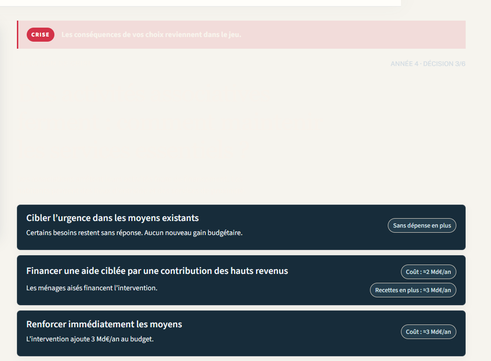
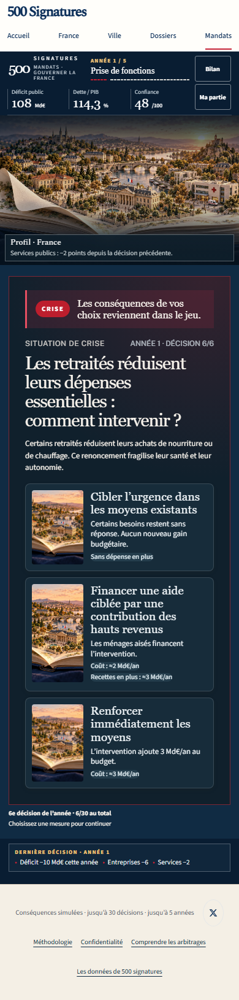

# Lisibilité du dossier de crise

La capture **avant** a été fournie par l’utilisateur : le titre, le récit et le repère de décision sont clairs sur fond clair.

Les captures **après** proviennent du scénario de crise déterministe du test `mandats-board.test.mjs` (sauvegarde v9, scénario 0, après cinq décisions). Le panneau de crise possède un fond sombre explicite ; son titre, son récit, son bandeau et son repère d’année restent lisibles.

Le contraste du texte essentiel est contrôlé à au moins 4,5:1 sur le fond du panneau. Le même test passe aussi à 320 px et sous WebKit mobile.
